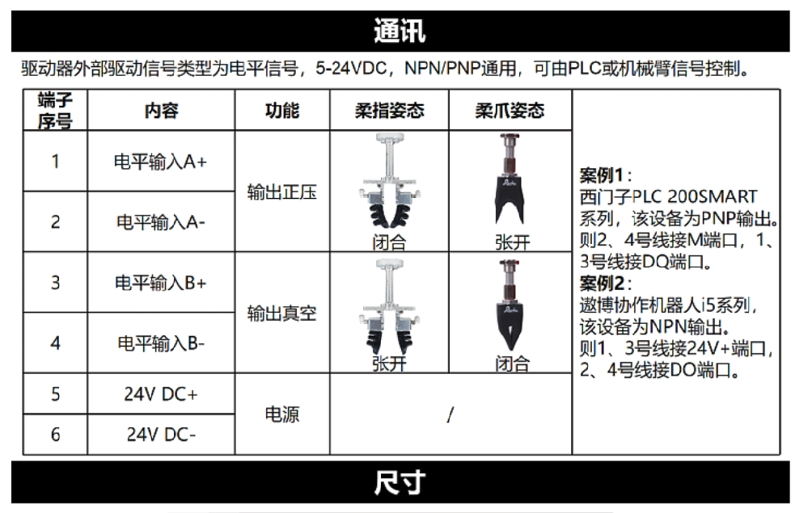

# AUBO ROS DEMO

## Environment

- Ubuntu 18.04
- ROS Melodic

## Requirements

```bash
# ros, ros-industrie, libconfig
sudo apt install ros-melodic-industrial-core
sudo apt install ros-melodic-moveit
sudo apt install libconfig-dev

# gazebo
sudo apt-get install ros-melodic-transmission-interface
sudo apt-get install ros-melodic-gazebo-ros-control
sudo apt-get install ros-melodic-joint-state-controller
sudo apt-get install ros-melodic-effort-controllers
sudo apt-get install ros-melodic-position-controllers
sudo apt-get install ros-melodic-moveit-visual-tools

# libprotobuf
sudo dpkg -i catch_project/3rdparty/libprotobuf/libprotobuf9v5_2.6.1-1.3_amd64.deb

# 编译 AUBO Repo
mkdir -p aubo_ros_demo/src
cd aubo_ros_demo/src
git clone -b melodic https://github.com/AuboRobot/aubo_robot

# 通过以下方法可以下载ros包相关依赖 
rosdep install --from-paths src --ignore-src -r -y

# 检查所有CMakeLists 中与melodic相关的内容
# 某些cmake中遗漏了melodic的检测, 可能导致Eigen3无法找到 !!
# /aubo_planner/CMakeLists.txt 添加 melodic eigen3 相关内容

# 对‘vtable for google::protobuf::MessageLite’未定义的引用
# https://github.com/AuboRobot/aubo_robot/issues/73
sudo apt-get update
sudo apt-get install gdebi
wget http://archive.ubuntu.com/ubuntu/pool/main/p/protobuf/libprotobuf9v5_2.6.1-1.3_amd64.deb
sudo gdebi ./libprotobuf9v5_2.6.1-1.3_amd64.deb
# libprotobuf 安装包已保存在3rdparty

# export LD_LIBRARY_PATH
# libconfig
export LD_LIBRARY_PATH=/path/to/libconfig/folder:$LD_LIBRARY_PATH
# liblog4cplus
export LD_LIBRARY_PATH=/path/to/liblog4cplus/folder:$LD_LIBRARY_PATH

# 编译
catkin_make
```


## Usage

### Aubo + MoveIt! 

- MoveIt + RVIZ 仿真

  ```bash
  # launch moveit + rviz
  roslaunch aubo_i5_moveit_config moveit_planning_execution.launch robot_ip:=127.0.0.1
  ```
  
  
  
- MoveIt + RVIZ + Gazebo 仿真

  ```bash
  # launch moveit + rviz
  roslaunch aubo_i5_moveit_config moveit_planning_execution.launch robot_ip:=127.0.0.1
  # launch gazebo
  roslaunch aubo_gazebo aubo_i5_gazebo_control.launch
  ```
  
  
  
- MoveIt + Arm 实际操作

  ```bash
  # 连接电源线, 按下电源箱开关
  # 示教器: 电源箱示教器使能开关, 示教器本体开关
  
  # 网线连接, 手动设置IP 192.168.0.100
  # 如何确认设备IP?
  roslaunch aubo_i5_moveit_config moveit_planning_execution.launch sim:=false robot_ip:=192.168.0.123
  
  # 切换 ROS 控制权 
  # ROS 控制
  rostopic pub -1 aubo_driver/controller_switch std_msgs/Int32 1
  # 非 ROS 控制, 可以通过示教器进行拖拽控制
  rostopic pub -1 aubo_driver/controller_switch std_msgs/Int32 0
  ```

  

-   MoveIt + Arm + Demo

    ```bash
    # 连接电源线, 按下电源箱开关
    # 示教器: 电源箱示教器使能开关, 示教器本体开关
    
    # 网线连接, 手动设置IP 192.168.0.100
    # 如何确认设备IP?
    roslaunch aubo_i5_moveit_config moveit_planning_execution.launch sim:=false robot_ip:=192.168.0.123
    
    # 启动 aubo_demo 
    rosrun aubo_demo aubo_i5_demo
    
    ```

    

-   读取机械臂末端位姿

    ```bash
    # 方法1: 通过示教器读取, Z坐标比TF小0.024, 和机械臂姿态无关
    
    # 方法2: 通过TF读取, 与路径规划设置的目标结果一致
    rosrun tf tf_echo /base_link /wrist3_Link
    ```


-   MoveIt 加入夹爪的配置

    -   需要加入夹爪URDF的文件
        -   /aubo_description/urdf/aubo_i5.urdf
        -   /aubo_description/urdf/aubo_i5.urdf.xacro
        -   /aubo_gazebo/urdf/aubo_i5.xacro
        
    -   moveit_setup_assistant 中的设置
        -   self-collisions 中加入夹爪的自碰撞检测
        
        -   planning_groups 中修改运动链, 加入夹爪的link
        
            

-   通过文件加入场景碰撞物体

    ```xml
    <arg name="scene_file" default="$(find project_name)/config/file.scene"/> 
    <node name = "moveit_publish_scene_from_text" pkg= "moveit_ros_planning" type = "moveit_publish_scene_from_text" args= "$(arg scene_file)"/>
    ```


### Aubo + Gripper 


-   Rochu夹爪连接方式
    -   夹爪电源外接
    -   1/2 号端子负责正压
        -   1号端子接控制柜24V
        -   2号端子接控制柜DO00
    -   3/4 号端子负责负压
        -   3号端子接控制柜24V
        -   4号端子接控制柜DO01




### Aubo + MoveIt! + easy_handeye + aruco_ros

-   use easy_handeye trouble shoot

    -   aruco_ros 编译使用

        -   opencv 3.4 with aruco module 
        -   cmake 中需要指定opencv 3.4 的位置
        -   aruco_ros使用时订阅的图像需要camera_info, 并且需要 projection_matrix
        -   代码中涉及到相机畸变系数的部分, 需要修改畸变系数个数为5, 与当前的相机驱动发布的畸变系数匹配

    -   easy_handeye

        -   安装 transforms3d
    
            ```bash
            sudo apt-get install python3 python3-pip ipython3 build-essential python-dev python3-dev
            pip install transforms3d==0.3.1 -i https://pypi.douban.com/simple
            ```

        -   'module' object has no attribute 'CALIB_HAND_EYE_TSAI'
    
            ```bash
            # install opencv_contrib_python
            pip install opencv_contrib_python==4.2.0.32 -i https://pypi.tuna.tsinghua.edu.cn/simple
            
            # 修改 easy_handeye/src/easy_handeye/handeye_calibration_backend_opencv.py 中 import cv2
            import sys
            sys.path.remove('/opt/ros/melodic/lib/python2.7/dist-packages')
            import cv2
            sys.path.append('/opt/ros/melodic/lib/python2.7/dist-packages')
            
            ```
        
    -   运行 easy_handeye 出现的问题
    
        -   找不到 aruco_marker_frame
    
            -   识别到aruco标记时再采样
    
        -   ```
            Error processing request: Lookup would require extrapolation into the past.  Requested time 1664186358.358911991 but the earliest data is at time 1664186358.417051554, when looking up transform from frame [aruco_marker_frame] to frame [camera_frame]
            ```
    
            
    
-   easy_handeye usage

    -   eyetohand (eyeonbase)

        ```bash
        roslaunch easy_handeye aubo_i5_d405_eyetohand.launch
        ```

        

    -   eyeinhand (eyeonhand)

        ```bash
        roslaunch easy_handeye aubo_i5_d405_eyeinhand.launch
        ```


### MoveIt! + occupancy_map

-   深度相机方面
    -   深度图或者点云, 从后处理的角度看, 深度图的效果不如点云, 点云目前可以通过PCL 进行降采样, 过滤离群点等操作
-   MoveIt! 需要编辑的文件
    -   `aubo_i5_moveit_config/config/sensor_3d.yaml`
        -   文件下可以指定 point cloud 或者 depth image 的传感器类型
        -   通过 padding_offset 与 padding_scale 可以设置机械臂自体检测的范围
    -   `aubo_i5_moveit_config/launch/aubo_i5_moveit_sensor_manager.launch.xml`
        -   这个launch文件中可以加入相机手眼标定的结果, 通过TF发布, 将四元数转化为ZYX的顺序
    -   `aubo_i5_moveit_config/launch/sensor_manager.launch.xml`
        -   指定octomap 的参考坐标系和分辨率, 分辨率大一些可以降低计算需求

-   octomap / occupancy_map

    -   启动 moveit 后 rviz 中会自动出现octomap

    -   同时可以加入pointcloud2用于比较

    -   octomap可用于路径规划的避障操作

        
