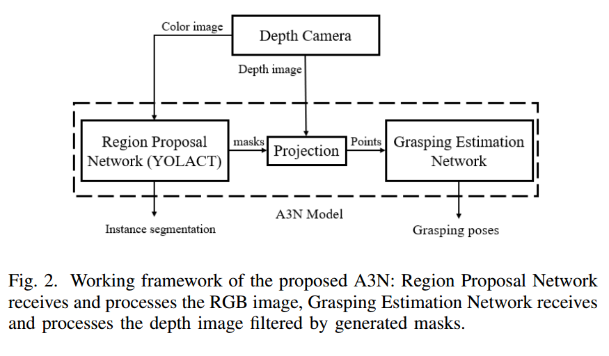
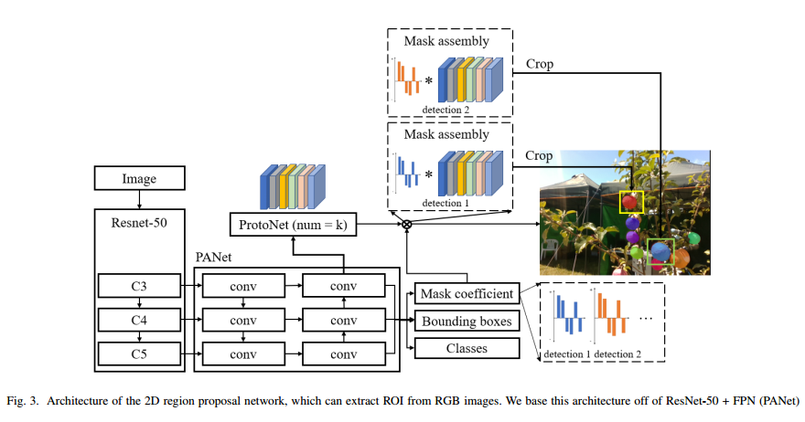
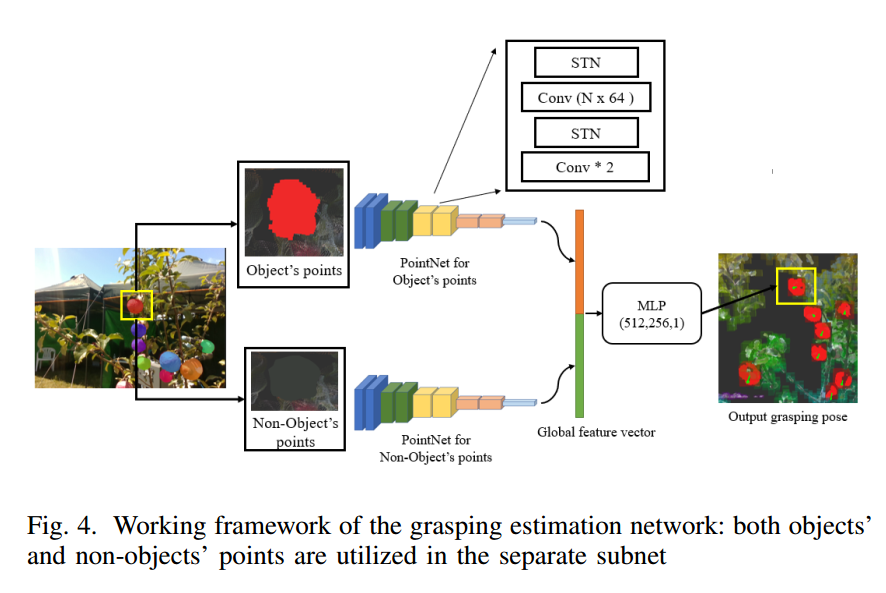
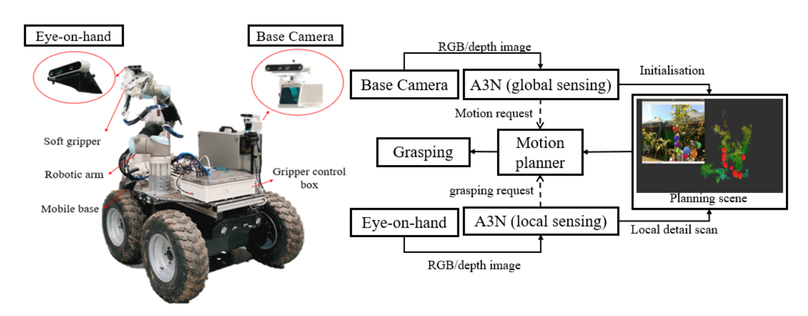

# Geometry-Aware Fruit Grasping Estimation for Robotic Harvesting in Orchards Note

## Introduction

-   A3N (Apple 3D Network)
    -   大概的特点
        -   endtoend
        -   detction 
        -   instance segmentation
        -   grasping estimation
        -   RGB-D camera
    -   具体的思路
        -   fruit detection
            -   通过 deeplearning 获得RGB图像的ROI
        -   grasping pose estimation
            -   PointNet 实现水果点云的 bbox regression, 并预测抓取的角度
        -   workspace modeling
            -   OctoMap 用来生成工作空间的避障地图
        -   global-to-local strategy
            -   从全局到局部的策略

## Related Works

-   介绍深度学习检测水果的例子, one-stage 和 two-stage
-   grasping estimation
    -   传统的抓取姿态估计通过ICP匹配物体和模板
    -   目前的深度学习抓取估计, diss了一波目前的方案, 不够安全, 不考虑周围信息, 不考虑复杂环境等

## Material and Methodology

-   数据采集 通过 D435

-   A3N 结构

    

    1.  首先彩图数据通过 Region Proposal Network 生成Masks
    2.  结合Masks和深度数据, 投影得到抓取目标的点云
    3.  通过 Grasping Estimation Network 生成抓取姿态
        -   输入点云包括两个部分, 通过两个subnet分别处理
            -   抓取物体的点云 objects point
            -   不包括抓取物体的场景点云 scene non-objects point

    

    -   YOLACAT

        

    -   grasping estimation network

-   抓取角度通过欧拉角表示, 并限制角度在 $[\frac{\pi}{4}, \frac{\pi}{4}]$ 之间

-   global-to-local 策略, 全局相机+局部相机的思路

-   Octomap 用于避障

-   整体的机器人结构
    -   全局相机似乎还加入了Livox

