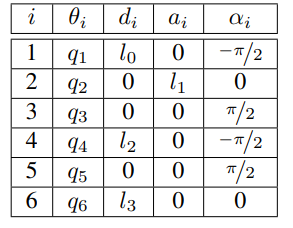
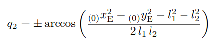
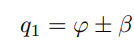

# 机械臂理论介绍

- 串联机械臂理论

  - 机械臂类型
  - 机械臂坐标系表达与转换
  - 机械臂运动学
  - 机械臂动力学
  - 机械臂运动规划
  - 机械臂运动控制
  - 机械臂视觉应用

## 串联机械臂理论简介

- 参考视频
  - [机械臂运动学教程: 机械臂+旋转矩阵+变换矩阵+DH+逆解+轨迹规划](https://www.bilibili.com/video/BV1oa4y1v7TY?p=1&vd_source=e4455003e32fdc49fb1b368513cd60bd)
- 参考书籍
  - 《机器人学导论》，J. J. Craig
  - 《现代机器人学：力学，规划，控制》，K. M. Lynch
  - LUH 机器人学课件

### 机械臂类型

常见的机械臂类型：

- 6自由度串联机械臂

  - 工作空间大
  - 灵活度高
  - 速度一般
  - 精度一般
  - 运动控制复杂

  
- 4自由度SCARA机械臂

  - 工作空间大
  - 灵活度一般
  - 速度快
  - 精度高
  - 运动控制相对简单

  
- 并联型机械臂

  - 工作空间相对安装空间较小
  - 灵活度低
  - 速度非常快
  - 精度非常高
  - 运动控制相对复杂

  
- 冗余机械臂

  - 关节数量大于末端的自由度
  - 能提供更多的灵活度，同样的目标位置，可以有不同的关节配置，以达到避障和避免奇异性的问题。
  - 运动控制相比普通6轴机械臂更复杂
  - 例子：KUKA-iiwa 7轴机械臂

    
- 视频资料

  - [机械臂的进化](https://www.zhihu.com/zvideo/1733137345912598528?playTime=133.4)
  - [7轴零空间运动](https://www.bilibili.com/video/BV1rG41147C2?p=9&vd_source=e4455003e32fdc49fb1b368513cd60bd)
  - [并联机械手](https://www.bilibili.com/video/BV1qe4y1q7LA/?spm_id_from=333.337.search-card.all.click&vd_source=e4455003e32fdc49fb1b368513cd60bd)

### 坐标系表达与转换

- 可视化资料
  - [四元数可视化](https://quaternions.online/)
  - [在线旋转表达转换](https://www.andre-gaschler.com/rotationconverter/)
  - [VisRo: Making Robotics Easy to Learn through Visualization](https://vis-ro.web.app/translation)

#### 一些向量计算规则

- 向量内积，可以描述向量间的投影关系

$$
\boldsymbol{a\cdot b} = \boldsymbol{a}^\mathrm{T}\boldsymbol{b} = \sum_{i=1}^{3}a_ib_i = |\boldsymbol{a}||\boldsymbol{b}|\cos<\boldsymbol{a}, \boldsymbol{b}>
$$

- 向量外积，外积的结果是一个垂直于叉乘的两个向量的向量，大小为$|a||b|sin<a,b>$,是两个向量张成的四边形的有向面积

  $$
  \boldsymbol{a}\times\boldsymbol{b} = 
      \begin{Vmatrix} 
      \boldsymbol{e}_1 & \boldsymbol{e}_2 & \boldsymbol{e}_3 \\
      a_1 & a_2 & a_3 \\
      b_1 & b_2 & b_3 \\
      \end{Vmatrix} = 
  
      \begin{bmatrix}
      a_2 b_3 - a_3 b_2 \\
      a_3 b_1 - a_1 b_3 \\
      a_1 b_2 - a_2 b_1
      \end{bmatrix} = 
  
      \begin{bmatrix}
      0 & -a_3 & a_2 \\
      a_3 & 0 & -a_1 \\
      -a_2 & a_1 & 0
      \end{bmatrix}\boldsymbol{b} 
  
      \xlongequal{\mathrm{def}} 
  
  \boldsymbol{a}^{\land}\boldsymbol{b} \\
  $$
- 反对称矩阵：

  $$
  \boldsymbol{a}^{\wedge} = 
  	\begin{bmatrix}
      0 & -a_3 & a_2 \\
      a_3 & 0 & -a_1 \\
      -a_2 & a_1 & 0
  	\end{bmatrix}
  $$

#### 空间旋转的矩阵表达

- 旋转矩阵 $ ^0\boldsymbol{R}_B$ 表示了坐标系 $\rm{(KS)}_B$ 在坐标系 $(\rm{KS})_0$ 中的表达

  $$
  ^0\boldsymbol{R}_\mathrm{B}=\left(_{(0)}\boldsymbol{e}_x^{(\mathrm{B})},_{(0)}\boldsymbol{e}_y^{(\mathrm{B})},_{(0)}\boldsymbol{e}_z^{(\mathrm{B})}\right) \\
  
  ^0\boldsymbol{R}_\mathrm{B}=\left(_{(0)}\boldsymbol{e}_y^{(0)}, -_{(0)}\boldsymbol{e}_x^{(0)},_{(0)}\boldsymbol{e}_z^{(0)}\right)=\left(\begin{array}{ccc}0&-1&0\\1&0&0\\0&0&1\end{array}\right)
  $$
- 三维空间下旋转矩阵大小为 3x3
- 旋转矩阵是正交矩阵，其逆为自身的转置
- 旋转矩阵的行列式为1
- 旋转矩阵每一列的平方和为1

  $$
  \mathrm{SO}(3) = \{\boldsymbol{R}\in\R^{3\times 3}|\boldsymbol{R}\boldsymbol{R}^\mathrm{T}=\boldsymbol{I}, \mathrm{det}(\boldsymbol{R}) = 1\} \\
  \boldsymbol{R}^{-1} = \boldsymbol{R}^{\mathrm{T}}\\
  \boldsymbol{a}' = \boldsymbol{R}^{-1}\boldsymbol{a} = \boldsymbol{R}^{\mathrm{T}}\boldsymbol{a}
  $$
- 旋转矩阵属于特殊正交群 SO(3) (Special Orthogonal Group)，（只有**一个**良好的运算的集合，称之为群）

  $$
  \boldsymbol{R}_{1}+\boldsymbol{R}_{2} \notin \mathrm{SO}(3) \\
  \boldsymbol{R}_{1} \boldsymbol{R}_{2} \in \mathrm{SO}(3)
  $$
- 旋转矩阵不满足交换律

  $$
  \boldsymbol{R}_1\boldsymbol{R}_2\neq \boldsymbol{R}_2\boldsymbol{R}_1
  $$

#### 空间旋转的复式变换表达（欧拉角）

- 基础角度变换

  - 任意两个坐标系之间的旋转关系，可以通过**三次**按照一定顺序的**基础旋转变换**来表达。
  - 基础旋转变换：指通过XYZ其中一个轴进行旋转得到的旋转变换
  - 旋转角度方向默认通过右手定则，即右手大拇指指向轴箭头方向，四指环绕方向指向旋转角正方向

    $$
    \begin{aligned}\boldsymbol R_x(\alpha)&=\left(\begin{array}{ccc}1&0&0\\0&\cos(\alpha)&-\sin(\alpha)\\0&\sin(\alpha)&\cos(\alpha)\end{array}\right)\\\boldsymbol R_y(\beta)&=\left(\begin{array}{ccc}\cos(\beta)&0&\sin(\beta)\\0&1&0\\-\sin(\beta)&0&\cos(\beta)\end{array}\right)\\\boldsymbol R_z(\gamma)&=\left(\begin{array}{ccc}\cos(\gamma)&-\sin(\gamma)&0\\\sin(\gamma)&\cos(\gamma)&0\\0&0&1\end{array}\right)\end{aligned}
    $$

    
- 欧拉角的分类

  - **按照旋转轴分类**

    - **Proper Euler angles** (*z*-*x*-*z*, *x*-*y*-*x*, *y*-*z*-*y*, *z*-*y*-*z*, *x*-*z*-*x*, *y*-*x*-*y*)

      - 也被称为 classisc euler angles
      - 特点：第一次与第三次旋转角相同
    - **Tait–Bryan angles** (*x*-*y*-*z*, *y*-*z*-*x*, *z*-*x*-*y*, *x*-*z*-*y*, *z*-*y*-*x*, *y*-*x*-*z*)

      - 也被称为 Cardan angles, nautical angles, (heading, elevation, and bank), (RPY: yaw, pitch, and roll).
      - 特点：三次旋转角不同
  - **按照参考坐标系分类**

    - 欧拉角-内旋法 intrinsic rotations （又称动态欧拉角）

      - 基于**每次旋转之后的坐标系**
      - 旋转矩阵应用**右乘**顺序
      - 示例：（Cardan-Angle）

        1. 绕原坐标系的 x 轴旋转 $\alpha$
        2. 绕新坐标系的 y 轴旋转 $\beta$
        3. 绕新坐标系的 z 轴旋转 $\gamma$

        $$
        \boldsymbol{R}_{\mathrm{KARD}}(\alpha,\beta,\gamma)=
        
        \underbrace{\overbrace{\boldsymbol{R}_x(\alpha)}^{1.}\overbrace{\boldsymbol{R}_y(\beta)}^{2.}\overbrace{\boldsymbol{R}_z(\gamma)}^{3.}}_{\text{right multiplication}}
        $$

        
    - 欧拉角-外旋法 extrinsic rotations （又称静态欧拉角）

      - 基于**世界坐标系**
      - 旋转矩阵应用**左乘**顺序
      - 示例：（RPY-Angle）

        1. 绕世界坐标系的 x 轴旋转 $\alpha$
        2. 绕世界坐标系的 y 轴旋转 $\beta$
        3. 绕世界坐标系的 z 轴旋转 $\gamma$

        $$
        \boldsymbol{R}_{\mathrm{RPY}}(\alpha,\beta,\gamma)=
        
        \underbrace{\overbrace{\boldsymbol{R}_x(\gamma)}^{3.}\overbrace{\boldsymbol{R}_y(\beta)}^{2.}\overbrace{\boldsymbol{R}_z(\alpha)}^{1.}}_{\text{left multiplication}}
        $$
  - 欧拉角 Gimbal-Lock 万向锁问题

    - 一旦选择±90°作为第二次旋转角度，就会导致第一次旋转和第三次旋转等价（第三次的旋转相当于叠加在第一次旋转上），丢失了一个表示维度。这种性质不适合插值和迭代等应用。
    - [万向锁问题动画演示](https://www.bilibili.com/video/BV1MZ4y1m7CT/?spm_id_from=333.337.search-card.all.click&vd_source=0f805e57bae4caccd39bef0a80028bec)
    - [万向锁问题解释](https://blog.csdn.net/weixin_41364246/article/details/129402879)
  - 欧拉角的正逆解

    - 正解：通过三次基础旋转获得复式旋转矩阵

      $$
      \boldsymbol{R}_\mathrm{xyz} = \boldsymbol{R}_\mathrm{x}(\alpha)\boldsymbol{R}_\mathrm{y}(\beta)\boldsymbol{R}_\mathrm{z}(\gamma)
      $$
    - 逆解：通过复式旋转矩阵逆推得到三次基础旋转

      - 分析法
      - 数值法
      - 多解
  - 欧拉角表达法的优缺点

    - 优点
      - 标记简单，只需三个变量
      - 表达方式直观
    - 缺点
      - 旋转顺序影响结果
      - 欧拉角表达方式有多种变体
      - 万向锁问题

#### 空间旋转的轴角表达

- 任意旋转都可以用一个旋转轴和一个旋转角来刻画
- 旋转向量的方向与单位长度的旋转轴 $\boldsymbol{u}$ 一致，长度等于旋转角$\theta$，则可以表示为 $\theta \boldsymbol{u}$

  
- **罗德里格斯公式**

  - 从旋转向量 $\theta \boldsymbol{u}$ 到旋转矩阵 $\boldsymbol{R}$

  $$
  \boldsymbol{R} = \cos(\theta )\boldsymbol{I} + (1-\cos(\theta))\boldsymbol{u}\boldsymbol{u}^{\mathrm{T}} + \sin(\theta)\boldsymbol{u}^{\land}  
  
  \\
  
  \boldsymbol{u}=(u_x,u_y,u_z)^\mathrm{T} 
  
  \\
  \mathrm{c}_\theta=\cos(\theta)
  
  \\
  
  \mathrm{s}_\theta=\sin(\theta). 
  
  \\
  
  \boldsymbol{R}=\begin{pmatrix}u_x^2(1-\mathrm{c}_\theta)+\mathrm{c}_\theta&u_x u_y(1-\mathrm{c}_\theta)-u_z \mathrm{s}_\theta&u_x u_z(1-\mathrm{c}_\theta)+u_y \mathrm{s}_\theta\\u_x u_y(1-\mathrm{c}_\theta)+u_z \mathrm{s}_\theta&u_y^2(1-\mathrm{c}_\theta)+\mathrm{c}_\theta&u_y u_z(1-\mathrm{c}_\theta)-u_x \mathrm{s}_\theta\\u_x u_z(1-\mathrm{c}_\theta)-u_y \mathrm{s}_\theta&u_y u_z(1-\mathrm{c}_\theta)+u_x \mathrm{s}_\theta&u_z^2(1-\mathrm{c}_\theta)+\mathrm{c}_\theta\end{pmatrix}
  $$

  - 从旋转矩阵 $\boldsymbol{R}$ 到旋转向量 $\theta \boldsymbol{n}$，

    - 方法1（SLAMBOOK2）：罗德里格斯公式（Rodrigues），通过对 $\boldsymbol{R}$ 求迹（tr, trace, 即求矩阵对角线元素之和）：

      $$
      \theta = \arccos(\frac{(\mathrm{tr}(\boldsymbol{R})) - 1}{2}) \\
      \theta = \arccos(\frac{(1+2\cos(\theta)) - 1}{2}) \\
      \boldsymbol{R}\boldsymbol{n} 
      = \boldsymbol{n}, (\boldsymbol{R}-\bold{I})\boldsymbol{n} = \boldsymbol{0}
      $$
    - 方法2（LUH ROBOTIK1 Script）：

      $$
      \left.\boldsymbol{R}^*=\left(\begin{array}{ccc}r_{11}&r_{12}&r_{13}\\r_{21}&r_{22}&r_{23}\\r_{31}&r_{32}&r_{33}\end{array}\right.\right) 
      \\
      \cos(\theta)=\frac{1}{2}\left(r_{11}+r_{22}+r_{33}-1\right)
      \\
      \sin(\theta)=\pm\frac{1}{2} \sqrt{(r_{32}-r_{23})^2+(r_{13}-r_{31})^2+(r_{21}-r_{12})^2}
      \\
      \theta=\arctan2\left(\sin(\theta),\cos(\theta)\right)
      \\
      \boldsymbol{u}=(u_x,u_y,u_z)^\mathrm{T}=\frac{1}{2 \sin(\theta)} (r_{32}-r_{23},r_{13}-r_{31},r_{21}-r_{12})^\mathrm{T}
      $$
- 轴角表达法的优缺点

  - 优点

    - 较少的参数数量
    - 适用于插值应用
    - 相对直观的表达
  - 缺点

    - 不方便表示连续旋转
    - 旋转向量的奇异性发生在转角 $\theta$ 超过$2\pi$时产生周期性

#### 旋转的四元数表达

- 四元数没有奇异性，可以解决三维向量描述旋转时的奇异性问题
- 四元数基本定义

  $$
  \begin{align}
  \boldsymbol{q} &= q_0 + q_1\mathrm{i} + q_2\mathrm{j} + q_3\mathrm{k} \\
  \boldsymbol{q} &= [s, \boldsymbol{v}^{\mathrm{T}}], s=q_0\in\R,\boldsymbol{v}=[q_1, q_2, q_3]^{\mathrm{T}}\in\R^3 \\
  \end{align}
  $$
- 四元数运算

  - 加减

    $$
    \boldsymbol{q}_a\pm\boldsymbol{q}_b = [s_a\pm s_b,\boldsymbol{v}_a\pm\boldsymbol{v}_b]^{\mathrm{T}}
    $$
  - 乘法

    $$
    \boldsymbol{q}_a \boldsymbol{q}_b = [s_a s_b - \boldsymbol{v}_a^{\mathrm{T}}\boldsymbol{v}_b, s_a\boldsymbol{v}_b + s_b\boldsymbol{v}_a + \boldsymbol{v}_a\times \boldsymbol{v}_b]^{\mathrm{T}}
    $$
  - 模长

    $$
    \begin{align}
    \begin{Vmatrix}\boldsymbol{q}_a\end{Vmatrix} &= \sqrt{s_a^2 + x_a^2 + y_a^2 + z_a^2} \\
    
    \begin{Vmatrix}\boldsymbol{q}_a\boldsymbol{q}_b\end{Vmatrix} &= \begin{Vmatrix}\boldsymbol{q}_a\end{Vmatrix}\begin{Vmatrix}\boldsymbol{q}_b\end{Vmatrix}
    \end{align}
    $$
  - 共轭

    $$
    \boldsymbol{q}^{*} = [s_a, -\boldsymbol{v}_a]^{\mathrm{T}} \\
    \boldsymbol{q}^{*}\boldsymbol{q} = \boldsymbol{q}\boldsymbol{q}^{*} = [s_a^2 + \boldsymbol{v}^{
    \mathrm{T}}\boldsymbol{v}, \boldsymbol{0}]^{\mathrm{T}}
    $$
  - 逆

    $$
    \boldsymbol{q}^{-1} = \boldsymbol{q}^{*}/\begin{Vmatrix}\boldsymbol{q}\end{Vmatrix}^2 \\
    \boldsymbol{q}\boldsymbol{q}^{-1} = \boldsymbol{q}^{-1}\boldsymbol{q} = 1 \\
    (\boldsymbol{q}_a\boldsymbol{q}_b)^{-1} = \boldsymbol{q}_b^{-1}\boldsymbol{q}_a^{-1}
    $$
  - 数乘

    $$
    \mathrm{k}\boldsymbol{q} = [\mathrm{k}s,\mathrm{k}\boldsymbol{v}]^{\mathrm{T}}
    $$
- 四元数旋转

  - 空间三维点 $\boldsymbol{p} = [x,y,z]\in\R^{3}$ 经过旋转 $\boldsymbol{q}$ 变为 $\boldsymbol{p}'$
    $$
    \boldsymbol{p} = [0,x,y,z]^{\mathrm{T}} = [0, \boldsymbol{v}]^\mathrm{T} \\
    \boldsymbol{p}' = \boldsymbol{q}\boldsymbol{p}\boldsymbol{q}^{-1}
    $$
- 四元数转换

  - 四元数到旋转矩阵

    $$
    \boldsymbol{R} = \boldsymbol{v}\boldsymbol{v}^{\mathrm{T}} + s^2\boldsymbol{I} + 2s\boldsymbol{v}^{\wedge} + (\boldsymbol{v}^{\wedge})^{2} 
    
    \\ \\
    
    \left.\boldsymbol{R}=\left(\begin{array}{ccc}q_0^2+q_1^2-q_2^2-q_3^2&2q_1q_2+2q_0q_3&2q_1q_3-2q_0q_2\\2q_1q_2-2q_0q_3&q_0^2-q_1^2+q_2^2-q_3^2&2q_2q_3+2q_0q_1\\2q_1q_3+2q_0q_2&2q_2q_3-2q_0q_1&q_0^2-q_1^2-q_2^2+q_3^2\end{array}\right.\right)
    $$
  - 旋转矩阵到四元数

    $$
    R=\begin{pmatrix}r_{11}&r_{12}&r_{13}\\r_{21}&r_{22}&r_{23}\\r_{31}&r_{32}&r_{33}\end{pmatrix} 
    
    \\ \\
    
    \begin{aligned}&q_0=\frac{\sqrt{tr(R)+1}}{2}\\&q_1=\frac{r_{23}-r_{32}}{4q_0}\\&q_2=\frac{r_{31}-r_{13}}{4q_0}\\&q_3=\frac{r_{12}-r_{21}}{4q_0}\end{aligned}
    $$
  - 四元数到轴角表达

  $$
  \begin{align}
  \theta &= 2\arccos(s) \\
  [n_x, n_y, n_z]^{\mathrm{T}} &= [q_1, q_2, q_3]^{\mathrm{T}}/\sin(\frac{\theta}{2})
  \end{align}
  $$
- 四元数表达法的优缺点

  - 优点
    - 参数数量少
    - 方便表达连续旋转
    - 适用于插值计算
    - 计算相比旋转矩阵更快
    - 无奇异性
  - 缺点
    - 表达方式不够直观

#### 齐次变换矩阵（空间旋转+位移）

- 三维空间下齐次变换矩阵大小为 4x4，属于特殊欧式群 SE(3)
- 在三维空间中的欧式齐次变换矩阵，由一个旋转矩阵 $\boldsymbol{R}$ 和一个位移向量 $\boldsymbol{t}$ 组成

  $$
  \mathrm{SE}(3) =
  \{
  \boldsymbol{T} = 
  	\begin{bmatrix}
  		\boldsymbol{R} & \boldsymbol{t} \\
  		\boldsymbol{0} & 1
  	\end{bmatrix} 
  	\in \R^{4\times 4} | \boldsymbol{R}\in\mathrm{SO}(3), t\in \R^3
  \}
  $$
- 求逆，逆矩阵表示相反的变换

  $$
  \left({}^0\boldsymbol{T}_{\mathrm{B}}\right)^{-1}={}^{\mathrm{B}}\boldsymbol{T}_0 = 
  	\begin{bmatrix}
  		(^0\boldsymbol{R}_\mathrm{B})^{\mathrm{T}} & -(^0\boldsymbol{R}_\mathrm{B})^{\mathrm{T}}_{(0)}\boldsymbol{t}_\mathrm{B} \\
  		\boldsymbol{0} & 1
  	\end{bmatrix}
  $$
- 行列式为1

  $$
  \det\begin{pmatrix}\boldsymbol{T}\end{pmatrix}=1.
  $$

- 通过齐次变换矩阵 $^0\boldsymbol{T}_\mathrm{B}$，求解坐标系B中的点P $_{(\mathrm{B})}\boldsymbol{x}_{\mathrm{P}}$ 在坐标系0中的坐标 $_{(\mathrm{0})}\boldsymbol{x}_{\mathrm{P}}$，位置向量补齐时需要加元素 1：

  $$
  _{(0)}\boldsymbol{x}_{\mathrm{P}}=\begin{pmatrix}_{(0)}\boldsymbol{t}_{\mathrm{P}}^{\mathrm{T}},1\end{pmatrix}^{\mathrm{T}}=\begin{pmatrix}_{(0)}x_{\mathrm{P}},_{(0)}y_{\mathrm{P}},_{(0)}z_{\mathrm{P}},1\end{pmatrix}^{\mathrm{T}}
  
  \\ \\
  
  _{(\mathrm{B})}\boldsymbol{x}_{\mathrm{P}}=\begin{pmatrix}_{(\mathrm{B})}\boldsymbol{t}_{\mathrm{P}}^{\mathrm{T}}, 1\end{pmatrix}^{\mathrm{T}}=\begin{pmatrix}_{(\mathrm{B})}x_{\mathrm{P}}, _{(\mathrm{B})}y_{\mathrm{P}}, _{(\mathrm{B})}z_{\mathrm{P}}, 1\end{pmatrix}^{\mathrm{T}}
  
  \\ \\
  
  \left._{(0)}\boldsymbol{x}_{\mathrm{P}}={}^0\boldsymbol{T}_{\mathrm{B}(\mathrm{B})}\boldsymbol{x}_{\mathrm{P}}=\left(\begin{array}{ccc|c}{} & ^0\boldsymbol{R}_{\mathrm{B}} &  & _{(\mathrm{0})}\boldsymbol{t}_{\mathrm{P}} \\ 0 & 0 & 0 & 1\end{array}\right.\right)\left(\begin{array}{ccc}{}_{(\mathrm{B})}\boldsymbol{r}_{\mathrm{P}}\\ 1\end{array}\right)=\left(\begin{array}{ccc}{} _{(\mathrm{0})}\boldsymbol{t}_{\mathrm{B}}+   ^0\boldsymbol{R}_{\mathrm{B}(\mathrm{B})}\boldsymbol{t}_{\mathrm{P}}\\ 1\end{array}\right)
  $$
- 通过齐次变换矩阵 $^0\boldsymbol{T}_\mathrm{B}$，求解坐标系 0 中的向量 $_{(0)}\boldsymbol{a}$ 在坐标系 B 中的向量 $_{(B)}\boldsymbol{a}$，向量补齐时加元素 0：

  $$
  _{(\mathrm{B})}\boldsymbol{a}^{\prime}={}^\mathrm{B}\boldsymbol{T}_0\boldsymbol{a}^{\prime}=\left(\begin{array}{c}^\mathrm{B}\boldsymbol{R}_{0 (0)}\boldsymbol{a}\\0\end{array}\right)
  $$
- 齐次变换矩阵的链式法则

  $$
  _{(0)}\boldsymbol{x}=^0\boldsymbol{T}_1{}^1\boldsymbol{T}_2\cdots{}^{n-2}\boldsymbol{T}_{n-1}{}^{n-1}\boldsymbol{T}_{n(n)}\boldsymbol{x}={}^0\boldsymbol{T}_{n(n)}\boldsymbol{x} 
  
  \\ \\
  
  ^i\boldsymbol{T}_j=\left({}^0\boldsymbol{T}_i\right)^{-1}{}^0\boldsymbol{T}_j={}^i\boldsymbol{T}_0{}^0\boldsymbol{T}_j.
  $$

### 机械臂运动学

#### 运动学定义

- 关节配置

  - 以六自由度的机械臂为例，则关节配置为一个6维向量，表示每个关节的角度

  $$
  \boldsymbol{q}=(q_1,q_2,\ldots,q_6)^\mathrm{T}
  $$
- 末端位姿

  - 表示机械臂末端 Endeffector 相对于机械臂基底坐标系的空间位姿，$x， y， z$ 表示三维空间坐标，$\phi, \psi, \theta$ 表示末端坐标系到基底坐标系的三个欧拉角变化角度。

  $$
  \boldsymbol{x}_\mathrm{E}=\begin{pmatrix}_{(0)}x_\mathrm{E},_{(0)}y_\mathrm{E},_{(0)}z_\mathrm{E},\phi_\mathrm{E},\psi_\mathrm{E},\theta_\mathrm{E}\end{pmatrix}^\mathrm{T}
  $$
- 正运动学

  - 已知各关节角度，求末端位姿
    $$
    \boldsymbol{x}_\mathrm{E}=f(\boldsymbol{q})
    $$
- 逆运动学

  - 已知末端位姿，求各关节角度
    $$
    \boldsymbol{q} = f(\boldsymbol{x}_{\mathrm{E}})
    $$

#### 正运动学

- 已知各关节角度，求末端位姿，即找到每个关节之间的坐标转换，通过齐次变换链式法则得到从机械臂基座到末端关节的变换矩阵。

$$
\boldsymbol{x}_\mathrm{E}=f(\boldsymbol{q})

\\ \\

{}^0\boldsymbol{T}_\mathrm{E}(\boldsymbol{q})={}^0\boldsymbol{T}_1(q_1){}^1\boldsymbol{T}_2(q_2) \cdots{}^{n-1}\boldsymbol{T}_\mathrm{E}(q_n)
$$

- DH参数（Denavit–Hartenberg parameters）：通过确立各个关节的坐标系，以及连续两个坐标系之间的齐次变换矩阵（通常为四个参数）参数，完成整个机械臂的建模。

  - 参考
    - [DH表示法(Standard Version)](https://zhuanlan.zhihu.com/p/696612275)
    - [DH表示法(Craig Version)](https://zhuanlan.zhihu.com/p/696195319)
    - [什么是改进DH参数](https://www.zhihu.com/question/23880951/answer/2957726427)
    - [Denavit–Hartenberg parameters](https://en.wikipedia.org/wiki/Denavit%E2%80%93Hartenberg_parameters)
    - [在线DH参数可视化](https://vis-ro.web.app/dh-model)
    - [为什么改进的DH模型优于标准DH模型，却大多都是使用标准D-H模型？](https://www.zhihu.com/question/22365926)
- SDH 标准DH参数

  

  1. 确定坐标系

     1. 确定每个关节以及他们的顺序 $ \boldsymbol{q} = \{q_1, q_2, \cdots, q_n \}$
     2. 坐标系下标从0开始，若有 n 个关节，则有 n+1 个坐标系
     3. 关节 $q_i$ 的旋转轴或位移轴为该关节坐标系的 $z_{i-1}$ 轴，如果是旋转轴， $z_{i-1}$ 轴方向通过右手定则确定正方向。
     4. 每个 $x_{i-1}$ 为 $z_{i-1}$ 与 $z_i$ 的公垂线
     5. 通过 $x_i$ 与 $z_i$ 确定 $y_i$ 以及 该坐标系的坐标原点 $o_i$
  2. 确定参数

     - 两个相邻坐标系之间的参数的定义
       1. $d_i$: 沿 $z_{i-1}$ 轴的位移，针对平移轴，$q_i$ 会包括在该参数中
       2. $\theta_i$: 绕 $z_{i-1}$ 轴的旋转，针对旋转轴， $q_i$ 会包括在该参数中
       3. $a_i$: 沿 $x_i$ 轴的位移
       4. $\alpha_i$: 绕 $x_i$ 轴的旋转
     - 如果有 n 个关节，则有 nx4 个参数
  3. 确定变换矩阵

     $$
     ^{i-1}T_i=\mathrm{Trans}_{z_{i-1}}(d_i)\cdot\mathrm{Rot}_{z_{i-1}}(\theta_i)\cdot\mathrm{Trans}_{x_i}(a_i)\cdot\mathrm{Rot}_{x_i}(\alpha_i)
     
     \\ \\
     
     ^0\boldsymbol{T}_\mathrm{E}(\boldsymbol{q}) = ^0\boldsymbol{T}_\mathrm{1}(q_1) ^0\boldsymbol{T}_\mathrm{2}(q_2) \cdots ^0\boldsymbol{T}_\mathrm{n}(q_n)
     $$
  4. 举例

     

     
- MDH 改进DH参数

  - 与 SDH 的区别

    1. 关节 $q_i$ 的旋转轴或位移轴为该关节坐标系的 $z_{i}$ 轴，而非 $z_{i-1}$
    2. 参数顺序为

       1. $a_i$: 沿 $x_{i-1}$ 轴的位移
       2. $\alpha_i$: 绕 $x_{i-1}$ 轴的旋转
       3. $d_i$: 沿 $z_i$ 轴的位移，针对平移轴，$q_i$ 会包括在该参数中
       4. $\theta_i$: 绕 $z_i$ 轴的旋转，针对旋转轴， $q_i$ 会包括在该参数中
    3. 两个关节坐标系之间的转换顺序

       $$
       ^{i-1}\boldsymbol{T}_i = \mathrm{Rot}_{x_{i-1}}\left(\alpha_i\right) \cdot \mathrm{Trans}_{x_{i-1}}\left(a_i\right)\cdot\mathrm{Rot}_{z_i}\left(\theta_i\right)\cdot\mathrm{Trans}_{z_i}\left(d_i\right)
       $$
    4. 标准的 DH 坐标系在处理树形结构（一个连杆末端连接两个关节）的时候会产生歧义；而改进的 DH 则没有这个问题。

    

#### 逆运动学

- 参考资料

  - [机器人的运动学解——逆向运动学解](https://zhuanlan.zhihu.com/p/450749372)
  - [机械臂的逆运动学求解有统一的方法吗](https://www.zhihu.com/question/400650301/answer/1282203168)
  - [MATLAB机器人工具箱中机器人逆解是如何求出来的](https://www.zhihu.com/question/41673569/answer/129670927)
- 已知末端位姿，求各关节角度

  $$
  \boldsymbol{q} = f(\boldsymbol{x}_{\mathrm{E}})
  $$
- 逆运动学的解法

  - 分析法
    - 特点
      - 通过正运动学公式或通过几何关系进行分析推理
      - 针对非冗余机械臂有限个解（存在多解）
      - 效率高于数值法
      - 随着自由度上升，求得解析解的难度也越来越大
      - 通用性差，适用性弱
      - 一般的6自由度机械臂需要满足**Pieper准则**，即机器人满足以下两个充分条件中的一个，就会得到封闭解，这两个条件是：
        - 三个相邻关节轴相交于一点
        - 三个相邻关节轴相互平行
    - 具体方法
      - 通过对正运动学公式利用三角函数等进行推理
      - 通过几何关系进行推理
      - Rosen Diankov 于2010年前后提出的 IKfast 算法，适用于 dof <= 7 的机械臂
  - 路径规划法
    - 在关节空间中进行路径规划
      - 基于图搜索
        - Dijkstra
        - A*
      - 基于采样
        - PRM
        - RRT
    - 例：OMPL 机械臂运动规划库
  - 数值法
    - 特点
      - 适用性广，更适合冗余机械臂
      - 需要更多时间进行迭代计算
      - 受初始位姿影响
      - 收敛性无法保证，可能陷入局部最优
    - 具体方法
      - 优化法
        - 传统优化，通过构建优化方程 $ \boldsymbol{f}(\boldsymbol{q}) - \boldsymbol{x}_\mathrm{E} = 0$ 获取目标 $\boldsymbol{q}$
          - Steepest Descent (SD) method
          - Newton–Raphson (NR) method
          - Variable metric (VM) method
          - Levenberg–Marquardt (LM) method
        - 智能优化
          - 遗传优化
          - 粒子群优化
          - 神经网络优化
          - ...
      - 迭代法
        - 基于雅克比矩阵的微分运动学

##### 分析法求解逆运动学的例子

- 例1：简单的 2DOF 平面连杆机械臂，通过**正运动学公式**分析求解逆运动学

- 例2：简单的 2DOF 平面连杆机械臂，通过**几何关系**分析求解逆运动学

  

- 其他例子：6自由度机械臂的分析法逆解
  - [工业机械臂逆运动学算法详解](https://zhuanlan.zhihu.com/p/440748878)
  - [UR和iiwa协作机械臂逆运动学解析解算法](https://zhuanlan.zhihu.com/p/326387013)
  - [UR3机械臂正逆运动学详解](https://blog.csdn.net/u011779517/article/details/111116938)
  - [遨博Aubo-i10机器人正逆运动学公式推导](https://blog.csdn.net/l1216766050/article/details/96961989)

##### 数值法求解逆运动学的例子

- cpprobotics demo

##### 其他软件工具

- Matlab Robotic Toolbox
  - 基于雅克比矩阵的迭代法
  - [MATLAB机器人工具箱中机器人逆解是如何求出来的](https://www.zhihu.com/question/41673569/answer/129670927)
- ROS MoveIt 中的工具
  - KDL
    - MoveIt 的默认运动学求解器，基于牛顿优化法
  - Track-IK
    - MoveIt 中基于雅克比矩阵的迭代法
- IKFAST - 获取 dof <= 7 自由度的解析解
  - [openrave-IKFAST](http://openrave.org/docs/latest_stable/openravepy/ikfast/)
  - [IKFAST-Generator （超好用的 IKFAST 在线工具）](https://www.hamzamerzic.info/ikfast_generator/)
  - [逆运动学库：IKFAST库的使用：ikfast](https://zhuanlan.zhihu.com/p/670483129)

#### 微分运动学（雅克比矩阵）

##### 雅克比矩阵定义

- 机械臂的微分运动学描述了末端的速度或加速度与关节的速度或加速度之间的关系。
- 雅克比矩阵描述了末端与关节在微小形变下的线性关系：

  $$
  \boldsymbol{x}_\mathrm{E} = \boldsymbol{f}(\boldsymbol{q})
  
  \\
  
  \Delta\boldsymbol{x}_\mathrm{E} = \boldsymbol{J}(\boldsymbol{q})\Delta\boldsymbol{q}
  
  \\
  
  \Delta\boldsymbol{q} = \boldsymbol{J}^{-1}(\boldsymbol{q})\Delta\boldsymbol{x}_\mathrm{E}
  $$
- 末端与关节的速度关系（一阶偏微分）：

  $$
  \dot{\boldsymbol{x}}_\mathrm{E}=\boldsymbol{J}(\boldsymbol{q}) \dot{\boldsymbol{q}}
  
  \\
  
  \dot{\boldsymbol{q}}=\boldsymbol{J}^{-1}(\boldsymbol{q}) \dot{\boldsymbol{x}}_\mathrm{E}
  $$
- 末端与关节的加速度关系（二阶偏微分）：

  $$
  \ddot{\boldsymbol{x}}_\mathrm{E}=\boldsymbol{J}(\boldsymbol{q}) \ddot{\boldsymbol{q}}+\dot{\boldsymbol{J}}(\boldsymbol{q},\dot{\boldsymbol{q}}) \dot{\boldsymbol{q}}
  
  \\
  
  \ddot{\boldsymbol{q}}=\boldsymbol{J}^{-1}(\boldsymbol{q}) \ddot{\boldsymbol{x}}_\mathrm{E}-\boldsymbol{J}^{-1}(\boldsymbol{q}) \dot{\boldsymbol{J}}(\boldsymbol{q},\dot{\boldsymbol{q}}) \boldsymbol{J}^{-1}(\boldsymbol{q}) \dot{\boldsymbol{x}}_\mathrm{E}
  $$
- 雅克比矩阵的广义逆 $\boldsymbol{J}^\dagger$: 由于雅可比矩阵不一定是方阵，根据关节数量的不同，求逆方式如下：

  $$
  \boldsymbol{J}^{\dagger}=\begin{cases}(\boldsymbol{J}^{T}\boldsymbol{J})^{-1}\boldsymbol{J}^{T},&n<6\\\boldsymbol{J}^{-1},&n=6\\\boldsymbol{J}^{T}(\boldsymbol{J}\boldsymbol{J}^{T})^{-1},&n>6&&\end{cases}
  $$

##### 雅克比矩阵的分类

###### 几何雅克比矩阵 $\boldsymbol{J}_\mathrm{G}$

- 描述的末端速度为相对于基地坐标系的速度向量以及角速度向量

  $$
  \Delta\boldsymbol{x}_\mathrm{E} = 
  
  \begin{bmatrix}
  _{(0)}\boldsymbol{v}_\mathrm{E} \\
  _{(0)}\boldsymbol{\omega}_\mathrm{E} 
  \end{bmatrix}
  
  =
  
  \begin{bmatrix}
  _{(0)}v_\mathrm{E,x} \\
  _{(0)}v_\mathrm{E,y} \\
  _{(0)}v_\mathrm{E,z} \\
  _{(0)}{\omega}_\mathrm{E,x}\\
  _{(0)}{\omega}_\mathrm{E,y}\\
  _{(0)}{\omega}_\mathrm{E,z}\\
  \end{bmatrix}
  $$
- 推导过程基于DH参数传递链：

  $$
  _{(0)}\dot{\boldsymbol{x}}_{\mathrm{E,G}} = 
  
  \begin{bmatrix}
  _{(0)}\dot{\boldsymbol{x}}_{\mathrm{E,trans}} \\
  _{(0)}\dot{\boldsymbol{x}}_{\mathrm{E,rot}}
  \end{bmatrix}
  
  =
  \underbrace{
  \begin{bmatrix}
  \boldsymbol{j}_{\mathrm{t, 1}} & \cdots & \boldsymbol{j}_{\mathrm{t, n}} 
  \\
  \boldsymbol{j}_{\mathrm{r, 1}}  & \cdots & \boldsymbol{j}_{\mathrm{r, n}} 
  \end{bmatrix}}_{\boldsymbol{J}_\mathrm{G}(\boldsymbol{q})}
  \dot{\boldsymbol{q}}
  
  \\
  
  \begin{aligned}
  &\text{translation joint: } 
  \begin{bmatrix}
  \boldsymbol{j}_{\mathrm{t, i}}
  \\
  \boldsymbol{j}_{\mathrm{r, i}} 
  \end{bmatrix}
  = 
  \begin{bmatrix}
  _{(0)}\boldsymbol{e}_z^{i-1}
  \\
  \boldsymbol{0} 
  \end{bmatrix}
  
  \\
  &\text{rotation joint: }
  \begin{bmatrix}
  \boldsymbol{j}_{\mathrm{t, i}}
  \\
  \boldsymbol{j}_{\mathrm{r, i}} 
  \end{bmatrix}
  = 
  \begin{bmatrix}
  _{(0)}\boldsymbol{e}_z^{i-1} \times _{(0)}\boldsymbol{r}_{i-1,\mathrm{E}}
  \\
  \boldsymbol{0} 
  \end{bmatrix}
  
  \\ \\
  
  &\text{with: } \\
  & _{(0)}\boldsymbol{e}_z^{(i-1)}=\underbrace{^0\boldsymbol{R}_1{}^1\boldsymbol{R}_2\ldots{}^{i-2}\boldsymbol{R}_{i-1}}_{^0\boldsymbol{R}_{i-1}}\left(\begin{array}{c}0\\0\\1\end{array}\right)
  
  \\
  
  & \left.\left(\begin{array}{c}_{(0)}\boldsymbol{r}_{(i-1), \mathrm{E}}\\0\end{array}\right.\right)=\underbrace{^0\boldsymbol{T_1}^1\boldsymbol{T_2}\ldots^{n-1}\boldsymbol{T_\mathrm{E}}}_{^0\boldsymbol{T_\mathrm{E}}}\left(\begin{array}{c}0\\0\\0\\1\end{array}\right)-\underbrace{^0\boldsymbol{T_1}^1\boldsymbol{T_2}\ldots^{i-2}\boldsymbol{T_{i-1}}}_{^0\boldsymbol{T_{i-1}}}\left(\begin{array}{c}0\\0\\0\\1\end{array}\right)
  
  \end{aligned}
  $$

###### 解析雅克比矩阵 $\boldsymbol{J}_\mathrm{A}$

- 通过对正运动学公式进行偏微分推导而来

  $$
  \boldsymbol{x}_\mathrm{E} = \boldsymbol{f}(\boldsymbol{q})
  
  \\ \\
  
  \left.\boldsymbol{J}(\boldsymbol{q})=\frac{\partial\boldsymbol{f}(\boldsymbol{q})}{\partial\boldsymbol{q}}=\left(\begin{array}{ccc}\frac{\partial f_1}{\partial q_1}&\cdots&\frac{\partial f_1}{\partial q_n}\\\vdots&\ddots&\vdots\\\frac{\partial f_m}{\partial q_1}&\cdots&\frac{\partial f_m}{\partial q_n}\end{array}\right.\right)\in\mathbf{R}^{m\times n}
  $$
- 描述的末端速度为相对于基底坐标系的速度分量以及**选择的空间旋转方式的角速度**，比如欧拉角内旋表达 $R_x(\alpha)R_y(\beta)R_z(\gamma)$ （即RPY），所以正运动学公式 $\boldsymbol{f}$ 中需要包括从旋转矩阵 $\boldsymbol{R}$ 推导到欧拉角旋转角度 $\alpha、\beta、\gamma$ 的内容：

  $$
  \Delta\boldsymbol{x}_\mathrm{E} = 
  
  \begin{bmatrix}
  _{(0)}\boldsymbol{v}_\mathrm{E}  \\
  _{(0)}\boldsymbol{\omega}_\mathrm{E, RPY} 
  \end{bmatrix}
  
  =
  
  \begin{bmatrix}
  v_\mathrm{x} \\
  v_\mathrm{y} \\
  v_\mathrm{z} \\
  _{(0)}{\omega}_\mathrm{E,\alpha}\\
  _{(0)}{\omega}_\mathrm{E,\beta}\\
  _{(0)}{\omega}_\mathrm{E,\gamma}\\
  \end{bmatrix}
  $$
- 由于旋转速度的表达方式不同，解析雅克比矩阵 $\boldsymbol{J}_\mathrm{A}$ 与几何雅克比矩阵 $\boldsymbol{J}_\mathrm{G}$ 存在如下关系

  - 在某些特殊情况下，如平面连杆机构：

    $$
    \boldsymbol{J}_\mathrm{A} = \boldsymbol{J}_\mathrm{G}
    $$
  - 针对末端旋转为欧拉角内旋表达 $R_x(\alpha)R_y(\beta)R_z(\gamma)$ （即RPY）

    - 角速度向量转换为RPY表达有以下关系：

      $$
      \begin{align}
      _{(0)}\boldsymbol{\omega}_{\mathrm{E}} &= 
      \begin{bmatrix}
      \dot{\alpha} \\
      0 \\
      0
      \end{bmatrix}_{\mathrm{Roll}}
      +
      \boldsymbol{R}_x(\alpha) \cdot
      \begin{bmatrix}
      0 \\
      \dot{\beta} \\
      0
      \end{bmatrix}_{\mathrm{Pitch}}
      +
      \boldsymbol{R}_x(\alpha) \cdot \boldsymbol{R}_y(\beta) \cdot
      \begin{bmatrix}
      0 \\
      0 \\
      \dot{\gamma}
      \end{bmatrix}_{\mathrm{Pitch}} 
      
      \\ \\
      
      &=
      
      \underbrace{\begin{bmatrix}
      1 & 0 & \sin(\beta) \\
      0 & \cos(\alpha) & -\sin(\alpha)\cos(\beta) \\
      0 & \sin(\alpha) & \cos(\alpha)\cos(\beta)
      \end{bmatrix}}_{\boldsymbol{\Omega}_\text{RPY}}
      \cdot
      \begin{bmatrix}
      \dot{\alpha} \\
      \dot{\beta} \\
      \dot{\gamma}
      \end{bmatrix}_\mathrm{RPY}
      
      \end{align}
      $$
    - 则解析雅克比矩阵 $\boldsymbol{J}_\mathrm{A}$ 与几何雅克比矩阵 $\boldsymbol{J}_\mathrm{G}$ 转换关系如下：

      $$
      \begin{align}
      \boldsymbol{J}_\mathrm{G} &= 
      \begin{bmatrix}
      \boldsymbol{E} & \boldsymbol{0} \\
      \boldsymbol{0} & \boldsymbol{\Omega}
      \end{bmatrix} 
      \cdot
      \boldsymbol{J}_\mathrm{A}
      
      \\ \\
      \boldsymbol{J}_\mathrm{A} &= 
      \begin{bmatrix}
      \boldsymbol{E} & \boldsymbol{0} \\
      \boldsymbol{0} & \boldsymbol{\Omega}^{-1}
      \end{bmatrix} 
      \cdot
      \boldsymbol{J}_\mathrm{G}
      
      \end{align}
      $$
      

- 例：一个平面2轴机械臂的雅克比矩阵

  

  

  - 不涉及末端角速度的解析雅克比矩阵：

  

  - 涉及末端角速度的几何雅克比矩阵，因为是平面连杆机构，所以与解析雅克比矩阵等效

  

##### 雅克比矩阵的应用

- 用于机械臂轨迹插值以及逆运动学的数值解

  $$
  \begin{aligned}
  \boldsymbol{q}_{i+1}& =\boldsymbol{q}_i+\Delta\boldsymbol{q}_i \\
  &=\boldsymbol{q}_i+\boldsymbol{J}^{-1}(\boldsymbol{q}_i) \Delta\boldsymbol{x}_{\mathrm{E}, i} \\
  &=\boldsymbol{q}_{i}+\boldsymbol{J}^{-1}(\boldsymbol{q}_{i}) (\boldsymbol{x}_{\mathrm{E}, i+1}-\boldsymbol{x}_{\mathrm{E}, i}),
  \end{aligned}
  $$
- 用于计算机械臂的操控性以及奇异性分析

  - 操控性越高，同样关节变化造成的末端变换更大，同时末端误差也会越大
  - 针对满秩的方阵雅克比矩阵，通过对雅克比矩阵进行特征分解(ED: Egien Decomposition)；对于普通矩阵，进行奇异值分解（SVD: Singular Value Decompostion）（参考 [矩阵分解—特征值分解与奇异值分解](https://zhuanlan.zhihu.com/p/613284889)）获取各特征向量上的特征值 $\lambda_i$

    $$
    \text{ED: }&\quad  \boldsymbol{J} = \boldsymbol{B}\boldsymbol{D}\boldsymbol{B}^{-1} = 
    \boldsymbol{B}
    \begin{pmatrix}
    \lambda_1 & & 0 \\
     & \ddots & \\
     0 &&\lambda_n
    \end{pmatrix}
    \boldsymbol{B}^{-1}
    
    \\ \\
    
    \text{SVD: }&\quad \boldsymbol{J} = \boldsymbol{U}\boldsymbol{\Sigma}\boldsymbol{V}^{\text{T}} = 
    \boldsymbol{U}
    \begin{pmatrix}
    \lambda_1 & \cdots & 0 \\
    \vdots  & \ddots & \vdots \\
     0 &&\lambda_n \\
     0 & \cdots & 0
    \end{pmatrix}
    \boldsymbol{V}^{\text{T}}
    $$
  - 特征值 $\lambda_i$ 表示机械臂末端在对应的特征向量上的操控性或灵活度：

    - $|\lambda_i|$ 大表示大的操作性或灵活度
    - $|\lambda_i|$ 小表示小的操作性或灵活度
    - $|\lambda_i| = 0$ 表示在该方向上没有可操作性或灵活度，表示机械臂在该方向上损失了一个自由度，遭遇了奇异性问题。
  - 整体的操作性，注意当操作性为0时说明机械臂处于奇异性状态，机械臂末端损失了自由度，无法完成对应的位移。

    $$
    \mu(\boldsymbol{q}) = \left| \Pi_i^n\lambda_i \right| = \left| \text{det}(\boldsymbol{J}(\boldsymbol{q})) \right|
    $$

    - 机械臂在处于奇异性位置时的特点：

      - 此时雅克比矩阵的行列式为 0

        $$
        \left| \text{det}(\boldsymbol{J}(\boldsymbol{q})) \right| = 0
        $$
      - 损失自由度
      - 微小的末端位置改变，造成巨大的关节变化，造成关节速度突变
      - 微小的末端负载会造成巨大的关节受力
      - [What are robot singularities?](https://www.youtube.com/watch?v=lD2HQcxeNoA)
    - 例：平面三连杆机构的奇异性配置：

      - 非奇异性状态

      

      - 奇异性状态：通过计算雅克比矩阵的行列式为0的情况，发现当关节2的角度为0或180度时，该机构陷入奇异性状态，此时末端在沿着第一关节的方向损失一个自由度。

        
    - 解决奇异性的方法

      - 轨迹优化
      - 关节冗余设置
      - 力学控制，避免过大的受力
- 用于描述末端负载与关节力矩之间的关系

  - 例：机械臂末端受到的力与力矩 $\boldsymbol{\mathcal{F}}$ 对末端产生微小变化 $\Delta \boldsymbol{x}_\text{E}$， 同时对关节产生力或力矩 $\boldsymbol{\tau}$ ，并发生形变 $\Delta\boldsymbol{q}$

  

  - 通过虚功分析，可以得到以下关系：
    $$
    \boldsymbol{\mathcal{F}} = 
    \begin{pmatrix}
    \boldsymbol{F} \\
    \boldsymbol{M}
    \end{pmatrix}
    \in \boldsymbol{\mathbb{R}}^{6}
    
    \\
    
    \Delta \boldsymbol{x}_\text{E}^\text{T} \boldsymbol{\mathcal{F}} = \Delta\boldsymbol{q}^\text{T} \boldsymbol{\tau} 
    
    \\
    
    {(\boldsymbol{J}(\boldsymbol{q})\Delta{\boldsymbol{q}})}^\text{T} \boldsymbol{\mathcal{F}} = \Delta\boldsymbol{q}^\text{T} \boldsymbol{\tau} 
    
    \\
    
    \boldsymbol{\tau} = \boldsymbol{J}^{\text{T}}(\boldsymbol{q})\boldsymbol{\mathcal{F}}
    
    \\
    
    \boldsymbol{\mathcal{F}} =( \boldsymbol{J}^{\text{T}}(\boldsymbol{q}))^{-1}\boldsymbol{\tau}
    $$
- 用于刚性分析

  - 假设每个关节的弹性模量为 $k_i$，整个系统的关节弹性矩阵为 $\boldsymbol{K} = \text{diag}(k_1, \cdots, k_n) = \text{diag}(\boldsymbol{k})$，则可以得出整个系统的末端弹性矩阵 $\boldsymbol{C}_\text{x}$:

  $$
  \begin{align}
  \boldsymbol{\tau} &= \boldsymbol{K} \Delta\boldsymbol{q}
  \\
  \boldsymbol{J}^\text{T}(\boldsymbol{q})\boldsymbol{\mathcal{F}} &= \boldsymbol{K}\Delta{\boldsymbol{q}}
  \\
  \boldsymbol{J}^\text{T}(\boldsymbol{q})\boldsymbol{\mathcal{F}} &= \boldsymbol{K}\boldsymbol{J}^{-1}(\boldsymbol{q})\Delta\boldsymbol{x}_\text{E}
  \\
  \Delta\boldsymbol{x}_\text{E} &= \underbrace{\boldsymbol{J}(\boldsymbol{q})\boldsymbol{K}^{-1}\boldsymbol{J}^\text{T}(\boldsymbol{q})}_{\boldsymbol{C}_\text{x}}\boldsymbol{\mathcal{F}}
  \\
  \boldsymbol{C}_\text{x} &= \boldsymbol{J}(\boldsymbol{q})\boldsymbol{K}^{-1}\boldsymbol{J}^\text{T}(\boldsymbol{q})
  
  \\
  \Delta\boldsymbol{x}_\text{E} &= \boldsymbol{C}_\text{x}\boldsymbol{\mathcal{F}}
  \\
  \boldsymbol{C}_\text{x} &= \boldsymbol{C}_\text{x}^\text{T}
  
  \end{align}
  $$

  - 对末端的弹性矩阵 $\boldsymbol{C}_\text{x}$ 进行特征分解，有以下特点：
    - 特征值越大，对应的特征向量表示了在该方向上其末端弹性越大，其刚性越小
    - 特征值越小，对应的特征向量表示了在该方向上其末端弹性越小，其刚性越大

#### 冗余机械臂

- 冗余机械臂定义

  $$
  \dim(\boldsymbol{q}) > \dim(\boldsymbol{x}_\text{E})
  $$
- 冗余机械臂的雅克比矩阵:

  $$
  \boldsymbol{J}_\text{reduntant} \in \mathbb{R}^{m\times n}, m < n
  $$
- 求逆：

  $$
  \boldsymbol{J}^{\dagger}=\begin{cases}(\boldsymbol{J}^{T}\boldsymbol{J})^{-1}\boldsymbol{J}^{T},&n<6\\\boldsymbol{J}^{-1},&n=6\\\boldsymbol{J}^{T}(\boldsymbol{J}\boldsymbol{J}^{T})^{-1},&n>6&&\end{cases}
  $$
- 操控性计算，以及奇异性判断

  $$
  \mu(\boldsymbol{q})=\det\left(\boldsymbol{J}(\boldsymbol{q})\boldsymbol{J}^\mathrm{T}(\boldsymbol{q})\right)
  $$
- 用途

  - 避障

    - 例：cpprobotics: Demo04
  - 避免奇异性
  - 优化关节角度配置，零空间运动

    - 末端位姿不变，改变关节配置，有无数解
  - 例：

    
- 零空间运动的推导：

  - 视频演示：[7 DOF Robotic Arm Null space motions](https://www.youtube.com/watch?v=XSsroN7dUlM)
  - 通过对冗余机械臂的雅克比矩阵进行高斯变换，可以求解当前末端变化对应的关节角度变化的特解 (particular solution) 和通解 (homogenous solution)。当此刻关节角度的变化满足**通解**的条件时，将不会对末端产生影响。

  $$
  \dot{\boldsymbol{x}}_\mathrm{E}=\boldsymbol{J}(\boldsymbol{q})\dot{\boldsymbol{q}},\quad\mathrm{with}\quad\boldsymbol{J}(\boldsymbol{q})\in \boldsymbol{\mathbb{R}}^{m\times n}(m<n)\quad\mathrm{und}\quad\mathrm{Rang}\left(\boldsymbol{J}(\boldsymbol{q})\right)=m
  
  \\ \\
  
  \text{after Gauss transformation}:
  
  \\
  
  \left.\boldsymbol{J}^*=\left(\begin{array}{cccc}\boxed{j_{11}}&j_{12}&0&0\\0&0&\boxed{j_{23}}&0\\0&0&0&\boxed{j_{34}}\end{array}\right.\right)
  
  \\
  
  \boldsymbol{\delta} = \boldsymbol{J}^*\dot{\boldsymbol{q}}
  
  \\
  
  \left(\begin{array}{cccc|c}\boxed{j_{11}}&j_{12}&0&0&\delta_1\\0&0&\boxed{j_{23}}&0&\delta_2\\0&0&0&\boxed{j_{34}}&\delta_3\end{array}\right)\quad(\equiv\boldsymbol{J}^*\dot{\boldsymbol{q}}=\boldsymbol{\delta})
  
  \\
  
  \dot{\boldsymbol{q}}=\underbrace{{\begin{pmatrix}\frac{\delta_{1}}{j_{11}}\\0\\\frac{\delta_{2}}{j_{23}}\\\frac{\delta_{3}}{j_{34}}\end{pmatrix}}}_{{\text{particular solution}}}+\underbrace{{\lambda\begin{pmatrix}-\frac{j_{12}}{j_{11}}\\1\\0\\0\end{pmatrix}}}_{{\text{homogenous solution}}}=\dot{\boldsymbol{q}}_{{\mathrm{p}}}+\dot{\boldsymbol{q}}_{{\mathrm{h}}}
  
  \\
  
  \boldsymbol{J}^*\dot{\boldsymbol{q}}_\text{h} = \boldsymbol{0}
  $$

### 机械臂运动规划

- 路径规划（只考虑路径，不考虑时间、速度、加速度等）

  - 基于采样
    - 基于采样的方法不需要完整表示位型空间，所以非常适合高维和复杂环境问题，且相比 search-based （A* D*等）方法，能更有效的处理非凸和杂乱的环境。但是 sampling-based 方法只具有概率完备性，不一定总能找到最优解，解的质量取决于采样点的数量和分布；很难处理动力学等复杂约束问题；不能保证解的有一致性，比如相似的起点或者终点状态，生成的解不能保证是相似的，无法对规划结果进行预判，这就使得自动规划的机器人无法进入极端追求稳定性的工业领域。
    
    - 例：PRM，RRT，RRT*，OMPL（MoveIt 默认机械臂路径规划库）
    
      - [RRT,RRT-Star 和 RRT-Star-Smart](https://zhuanlan.zhihu.com/p/161829703)
      - [Rapidly exploring random tree](https://en.wikipedia.org/wiki/Rapidly_exploring_random_tree#cite_note-incremental-8)
    
    - demo: cpprobotics/ArmNavigation/RRTStarSevenJointArmControl
    
      
    
  - 基于优化
    - 将运动规划问题表述为一个优化问题，目标是在满足机器人环境约束和动力学约束下，找到优化某个成本函数的轨迹。可以设计各种成本函数来实现不同的优化目标，比如最短路径、最优时间、最优能量等。基于优化的方法可以找到高质量的解决方案，且解具有一致性，可以处理机器人动力学和环境的复杂约束。但是 optimization-based 方法计算成本很高，尤其是对于高维系统；需要准确的机器人动力学和环境模型，这在实践中可能很难得到；在复杂环境下容易陷入局部最优解。
    - 例：CHOMP、STOMP
  
- 轨迹规划（考虑时间、速度、加速度）

### 机械臂动力学
