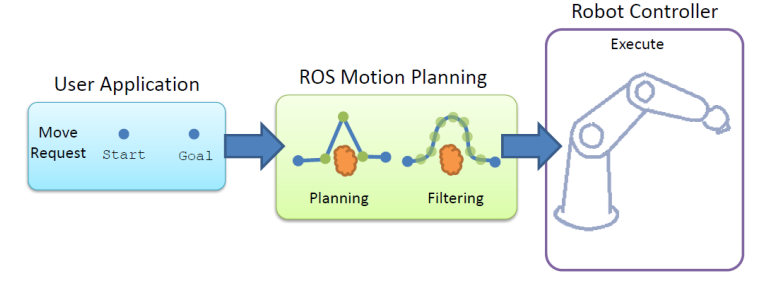
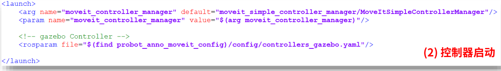

# DeepBlue_ROS_Tutorial

## 简介

本仓库为深蓝学院ROS MoveIt教程的代码库. 


视频教程百度网盘链接: 

链接: https://pan.baidu.com/s/1jcdnr3NCnYWMRROsdfRlSw?pwd=edfy 提取码: edfy 


## 环境

Ubuntu 18.04

ROS Melodic


## 笔记

### CH1 - CH2

ROS 安装与基础省略, 详见ROS官方教程.


### CH3 URDF

#### 机器人组成

-   执行机构
-   驱动系统
-   传感系统
-   控制系统


#### URDF 

-   介绍

    -   XML格式的描述机器人的模型文件

    -   `<link>`

        -   刚体部分的外观和物理属性
        -   连杆尺寸, 颜色, 形状, 惯性矩阵, 碰撞参数等

    -   `<joint>`

        -   两个 Link 之间的关系, 六种类型

        -   位置或速度的限制

        -   机器人关节的运动学和动力学属性

            

    -   `<robot>`

        -   机器人模型最顶层标签

-   缺点
    -   冗长重复
    -   参数修改麻烦
    -   没有参数计算功能
    -   改进方案
        -   xacro
        -   三维模型导出URDF


#### XACRO

-   功能

    -   宏定义

    -   文件包含

    -   可编程: 常量, 变量, 数学计算, 条件语句

        

#### 实践

-   URDF/XACRO 可视化

    ```bash
    # 启动marm模型可视化launch文件, 可视化对应的机器人urdf/xacro模型
    roslaunch marm_description view_marm.launch 
    ```

-   solidworks 导出 urdf

    -   安装 sw2urdfSetup.exe
    -   直接拖入 UR3.STEP 模型文件
    -   配置基准轴
    -   配置 sw2urdf link joint

    ```bash
    # 启动ur3模型可视化launch文件
    roslaunch ur3 display.launch
    ```

    

### CH4 MoveIt! 初识

#### MoveIt!简介

-   集成化开发平台

    -   运动规划
    -   操作控制
    -   3D感知
    -   运动学
    -   控制与导航

-   与传统机械臂编程控制的比较

    -   传统机械臂编程

        

    -   MoveIt!运动规划

        

-   三大核心功能
    -   运动学: KDL, Trac-IK, IKFast...
    -   路径规划: OMPL, CHOMP, SBPL...
    -   碰撞检测: FCL, PCD...


-   用户接口
    -   C++: move_group_interface 提供的API
    -   Python: moveit_commander 提供的API
    -   GUI: MoveIt! 的 rviz 插件
-   ROS参数服务器
    -   URDF: robot_description 参数, 机器人URDF模型描述信息
    -   SRDF: robot_description_semantic 参数, 机器人模型配置信息
    -   config: 其他配置信息, 关节限位, 运动学插件, 运动规划插件等


-   MoveIt 使用方法
    -   组装: 机器人URDF模型
    -   配置: MoveIt! Setup Assistant 配置工具
    -   驱动: 机器人控制器插件 (controller)
    -   控制: MoveIt! 控制机器人运动
        -   算法仿真
        -   物理仿真
        -   连接真实机器人


#### MoveIt! 可视化配置

-   启动 Setup Assistant

    ```
    rosrun moveit_setup_assistant moveit_setup_assistant
    ```

-   start 选择模型 .xacro 文件
-   self-collisions 设置自碰撞检测
    -   这里会检测和显示不需要自碰撞检测的 link pair, 包括:
        -   永远不会碰撞
        -   相邻的关节对
        -   一直处于碰撞
    -   FCL: Flexible Collision Library 碰撞检测库

-   virtual joints 设置虚拟关节
-   planning groups 配置规划组
    -   Kinematics 
        -   配置运动学求解器
    -   OMPL Planning
        -   OMPL:  The Open Motion Planning Library, 基于采样方法的开源机器人运动规划库
            -   PRM、RRT、EST、SBL、KPIECE、SyCLOP...
        -   OMPL 下有两大类规划算法
            -   Geometric planners: 考虑系统几何约束和运动学约束
            -   Control-based planners: 差分约束?
        -   不包含任何碰撞检测或可视化内容, 只设计运动规划
    -   Kinematic chain

-   Robot Poses 预定义的机械臂位姿

-   End Effector 配置终端效应器

-   Passive Joints 配置被动关节

-   ROS Control 配置控制器

    -   建议在文件中配置

-   Simulation 配置仿真环境如Gazebo

    -   建议在文件中配置

-   Autoher Information 作者信息

-   Configuration Files 设置配置文件

-   3D Perception 传感器的配置

-   Configuration Files

    -   生成 MoveIt! 配置文件包, `*_moveit_config` 

-   启动 moveit demo

    ```bash
    roslaunch probot_anno_moveit_config demo.launch
    ```

    

### CH5 MoveIt! 仿真环境

#### ROS  中的控制器插件简介

-   ros_control
    -   ROS 提供的机器人控制中间件
    -   一系列控制器接口, 传动装置接口, 硬件接口, 控制器工具箱等
    -   控制流程
        -   控制器管理器
            -   通用接口, 管理控制器
        -   控制器
            -   读取硬件状态, 发布控制命令
        -   硬件资源
            -   上下层之间的硬件资源接口
        -   硬件抽象
            -   直接与硬件交流, write/read 完成硬件操作
        -   真实机器人
            -   执行接受的命令

-   控制器
    -   joint_state_controller
    -   joint_effort_controller
    -   joint_position_controller
    -   joint_velocity_controller


#### 完善机器人模型与Gazebo配置

-   link 添加惯性参数和碰撞属性: /probot_description/urdf/probot_anno.xacro

    

-   joint 添加传动装置: /probot_description/urdf/probot_anno.xacro

    

-   gazebo 控制器插件: /probot_description/urdf/probot_anno.xacro

    

-   gazebo 加载机器人模型: /probot_gazebo/launch/probot_anno/probot_anno_gazebo_world

    

-   启动 Gazebo 仿真环境

    ```bash
    roslaunch probot_gazebo probot_anno_gazebo_world.launch
    ```

    

#### MoveIt! + Gazebo

##### MoveIt! + Gazebo/Robot 机器人控制框架

-   MoveIt
    -   MoveIt! API
        -   RVIZ
        -   C++
        -   Python
    -   MoveIt! 运动学+路径规划+碰撞检测 -> 轨迹数据
        -   3 main function
            -   Kinematics
            -   Path Planning
            -   Collision Checking
        -   output: trajectory data
        -   sub: joints state
    -   Follow Joint Trajectory 连接 Gazebo/Robot 的中间层
        -   Socket to Gazebo/Robot
        -   Action (Trajectort excution)
-   Gazebo/Robot
    -   Joint trajectory controller 路径插值等
        -   trajectory interpolation
    -   Joint state controller 反馈关节信息
        -   pub topics: joints state
    -   Robot body 机械臂本体执行移动命令
        -   execute move commands
        -   joint feedback


##### MoveIt! + Gazebo 仿真框架

-   **Joint trajectory controller**

    -   关节轨迹控制器

        -   线性样条, C0 连续, 位置连续
        -   三次样条, C1 连续, 位置速度连续
        -   五次样条, C2 连续, 位置速度加速度连续

    -   关节轨迹控制器参数配置: src/probot_gazebo/config/probot_anno_trajectory_control.yaml

        

    -   关节轨迹控制器启动配置: src/probot_gazebo/launch/probot_anno/probot_anno_trajectory_controller.launch

        

-   **Joint state controller**

    -   关节状态控制器参数配置: src/probot_gazebo/config/probot_anno_gazebo_joint_states.yaml

        

    -   关节状态控制器启动配置: src/probot_gazebo/launch/probot_anno/probot_anno_gazebo_states.launch

        

-   **Follow joint trajectory controller**

    -   跟随关节轨迹控制器参数配置

        

    -   跟随关节轨迹控制器启动配置

        


-   启动 MoveIt! + Gazebo: src/probot_gazebo/launch/probot_anno/probot_anno_bringup_moveit.launch

    -   配置

        

    -   启动

        ```bash
        # 启动 MoveIt! + Gazebo
        roslaunch probot_gazebo probot_anno_bringup_moveit.launch
        
        # 输出 follow_joint_trajectory/goal
        rostopic echo /probot_anno/arm_joint_controller/follow_joint_trajectory/goal
        ```

        


### CH6 MoveIt! 运动控制

#### MoveIt! API 编程接口

-   MoveIt 一般使用方法

    -   连接控制需要的规划组, 设置运动规划参数, 允许误差, 速度, 加速度等

    -   设置目标位姿
        -   关节运动, 关节目标, 正运动
        -   关节运动, 笛卡尔目标, 逆运动
        -   笛卡尔空间, 笛卡尔目标, 逆运动

    -   设置运动约束

    -   使用MoveIt! 规划到达目标的轨迹
        -   关节空间逆运动规划
        -   笛卡尔空间路径逆运动规划

    -   修改轨迹参数

    -   执行轨迹运动


#### 关节空间运动

-   关节运动, 关节目标, 正运动学

    -   创建规划组控制对象
    -   设置运动规划参数, 允许误差, 速度, 加速度等
    -   设置关节空间运动的目标关节角度
    -   执行关节正运动

    ```bash
    # launch moveit + gazebo
    roslaunch probot_gazebo probot_anno_bringup_moveit.launch
    
    # forward kinematic demo, joint move with joint target
    rosrun probot_demo moveit_fk_demo
    ```

-   关节运动, 笛卡尔目标, 逆运动学

    -   创建规划组的控制对象
    -   设置运动规划参数, 允许误差, 速度, 加速度等
    -   获取终端 link 名称
    -   设置目标位姿
        -   参考坐标系
        -   起始位姿
        -   终止位姿
    -   执行关节逆运动

    ```bash
    # launch moveit + gazebo
    roslaunch probot_gazebo probot_anno_bringup_moveit.launch
    
    # run inverse kinematic demo, joint move with cartesian target
    rosrun probot_demo moveit_ik_demo
    ```


#### 笛卡尔空间运动

-   创建规划组的控制对象
-   设置运动规划参数, 允许误差, 速度, 加速度等
-   获取终端 link 名称
-   设置目标位姿
    -   参考坐标系
    -   起始位姿
    -   路径规划 + 轨迹规划
        -   设置路点列表
        -   对路点列表进行路径规划
        -   检查路点覆盖率, 重新尝试规划
        -   对路径规划结果进行轨迹规划
-   执行笛卡尔空间轨迹规划结果

```bash
# launch moveit + gazebo
roslaunch probot_gazebo probot_anno_bringup_moveit.launch

# run cartesian path planning demo, cartesion move with cartesion path
rosrun probot_demo moveit_cartesian_demo
```


#### 自主避障运动

-   规划场景模块的结构

    -   用户接口
        -   C++
        -   Python
        -   RVIZ
    -   规划场景监听器
        -   机器人状态监听器
            -   机器人关节状态 /joint_states
        -   场景监听器
        -   外界环境监听器

    

-   附着物体避障例程

    -   增加场景障碍物
    -   增加手臂附着物
    -   关节单点运动 自动避障
    -   笛卡尔单点运动 自动避障
    -   笛卡尔路径 自动避障

    ```bash
    # 启动 moveit + gazebo
    roslaunch probot_gazebo probot_anno_bringup_moveit.launch
    
    # 启动避障demo
    rosrun probot_demo moveit_avoid_obstacle_demo     
    ```


### CH7 MoveIt! 轨迹规划进阶

#### 圆弧轨迹规划

-   根据圆弧公式计算路点, 可以根据圆心角度采样
-   根据路点进行笛卡尔路径规划

```bash
# 启动 moveit + gazebo
roslaunch probot_gazebo probot_anno_bringup_moveit.launch

# 圆弧轨迹demo 
rosrun probot_demo moveit_circle_demo             
```


#### 轨迹重定义

-   重新规划轨迹的速度

```bash
# 启动 moveit + gazebo
roslaunch probot_gazebo probot_anno_bringup_moveit.launch

# 轨迹重定义demo 
rosrun probot_demo moveit_revise_trajectory_demo  
```


#### 多轨迹连续运动

-   连接两个轨迹, 并重新规划轨迹的速度加速度, 使运行平滑

```bash
# 启动 moveit + gazebo
roslaunch probot_gazebo probot_anno_bringup_moveit.launch

# 多轨迹连接demo 
rosrun probot_demo moveit_continue_trajectory_demo
```


#### 更换运动学插件

-   KDL (Kinematics and Dynamics Library)

    -   数值解
    -   优点: 可求解封闭情况下的逆运动学
    -   缺点: 速度慢, 有时找不到解
    -   MoveIt! 默认运动学插件

-   TRACK-IK

    -   数值解

    -   求解效率比KDL更高, 更多解的可能

    -   求解结果不稳定

    -   配置使用方法

        ```bash
        # 安装
        sudo apt-get install ros-melodic-trac-ik-kinematics-plugin
        
        # 配置
        gedit probot_anno_moveit_config/config/kinematics.yaml
        # TRACK-IK
        kinematics_solver: trac_ik_kinematics_plugin/TRAC_IKKinematicsPlugin
        kinematics_solver_search_resolution: 0.005
        kinematics_solver_timeout: 0.005
        
        # 测试
        roslaunch probot_anno_moveit_config demo.launch
        ```
        

-   IKFAST

    -   解析解
    
    -   成功率高, 求解稳定, 速度快, 可以求解任意复杂运动链的运动学方程

    -   存在多解的选择问题

    -   安装

        -   尝试手动安装 IKFAST
    
            ```bash
            ### 安装依赖程序
            sudo apt-get install cmake g++ git ipython minizip python-dev python-h5py python-numpy python-scipy qt4-dev-tools
            
            ### 安装依赖库
            sudo apt-get install libassimp-dev libavcodec-dev libavformat-dev libavformat-dev libboost-all-dev libboost-date-time-dev libbullet-dev libfaac-dev libglew-dev libgsm1-dev liblapack-dev liblog4cxx-dev libmpfr-dev libode-dev libogg-dev libpcrecpp0v5 libpcre3-dev libqhull-dev libqt4-dev libsoqt-dev-common libsoqt4-dev libswscale-dev libswscale-dev libvorbis-dev libx264-dev libxml2-dev libxvidcore-dev
            
            ### 安装OpenSceneGraph-3.4
            sudo apt-get install libcairo2-dev libjasper-dev libpoppler-glib-dev libsdl2-dev libtiff5-dev libxrandr-dev
            git clone https://github.com/openscenegraph/OpenSceneGraph.git --branch OpenSceneGraph-3.4
            cd OpenSceneGraph
            mkdir build; cd build
            cmake .. -DDESIRED_QT_VERSION=4
            make -j$(nproc)
            sudo make install
            
            ### 安装sympy
            pip install --upgrade --user sympy==0.7.1
            
            ### 删除mpmath
            sudo apt remove python-mpmath
            
            ### 安装IKFast功能包
            sudo apt-get install ros-melodic-moveit-kinematics
            
            ### 安装 collada-urdf
            sudo apt-get install ros-melodic-collada-urdf
            
            ### 安装OpenRave
            sudo apt install git # probably already installed
            sudo apt install libboost-filesystem-dev libboost-system-dev libboost-python-dev libboost-thread-dev libboost-iostreams-dev libboost-numpy-dev
            sudo apt install libqt4-dev qt4-dev-tools libxml2-dev libode-dev
            sudo apt install libsoqt4-dev libcoin80-dev
            sudo apt install liblapack-dev
            sudo apt install libcollada-dom2.4-dp-dev  # Open .zae files, avoid cmake 3.19 error on 18.04 Bionic
            cd  # go home
            mkdir -p repos; cd repos  # create $HOME/repos if it doesn't exist; then, enter it
            git clone --branch master https://github.com/rdiankov/openrave.git
            cd openrave; mkdir build; cd build
            cmake .. -DOPT_VIDEORECORDING=OFF -DOPT_PYTHON=OFF
            make -j8
            sudo make install; cd  # install and go home
            # 验证是否安装成功, 启动openrave
            openrave
            
            ### 转换机器人描述文件 xacro -> urdf -> dae
            cd probot_description/urdf
            export MYROBOT_NAME="probot_anno"
            rosrun xacro xacro --inorder -o "$MYROBOT_NAME".urdf "$MYROBOT_NAME".xacro    
            rosrun collada_urdf urdf_to_collada "$MYROBOT_NAME".urdf "$MYROBOT_NAME".dae
            export IKFAST_PRECISION="5"
            cp "$MYROBOT_NAME".dae "$MYROBOT_NAME".backup.dae
            rosrun moveit_kinematics round_collada_numbers.py "$MYROBOT_NAME".dae "$MYROBOT_NAME".dae "$IKFAST_PRECISION"
            
            ### 查看生成的模型
            openrave "$MYROBOT_NAME".dae
            
            ### 该方法把python编译选项关闭了, 导致部分python脚本无法使用, 开启python编译后, 编译报错, boost问题
            ```
    
        
    
        -   尝试通过docker直接生成IKFAST的cpp文件
    
            ```bash
            ### 手动安装docker
            # 安装apt依赖包
            $ sudo apt-get install \
                apt-transport-https \
                ca-certificates \
                curl \
                gnupg-agent \
                software-properties-common
            # 添加docker官方密钥
            $ curl -fsSL https://mirrors.ustc.edu.cn/docker-ce/linux/ubuntu/gpg | sudo apt-key add -
            # 验证密钥
            $ sudo apt-key fingerprint 0EBFCD88
            pub   rsa4096 2017-02-22 [SCEA]
                  9DC8 5822 9FC7 DD38 854A  E2D8 8D81 803C 0EBF CD88
            uid           [ unknown] Docker Release (CE deb) <docker@docker.com>
            sub   rsa4096 2017-02-22 [S]
            # 设置稳定版仓库
            $ sudo add-apt-repository \
               "deb [arch=amd64] https://mirrors.ustc.edu.cn/docker-ce/linux/ubuntu/ \
              $(lsb_release -cs) \
              stable"
            # 安装 Docker Engine-Community
            $ sudo apt-get install docker-ce docker-ce-cli containerd.io
            # 测试docker是否安装成功
            $ sudo docker run hello-world
            Unable to find image 'hello-world:latest' locally
            latest: Pulling from library/hello-world
            1b930d010525: Pull complete                                  
            Digest: sha256:c3b4ada4687bbaa170745b3e4dd8ac3f194ca95b2d0518b417fb47e5879d9b5f
            Status: Downloaded newer image for hello-world:latest
            Hello from Docker!
            This message shows that your installation appears to be working correctly.
            # 启动docker服务
            $ sudo service docker start
            # 设置user权限
            $ sudo usermod -a -G docker $USER
            # log off/on to activate permission change
            
            # docker pull ros-openrave, 
            # 或者使用 auto_create_ikfast_moveit_plugin.sh 中的官方docker image
            $ docker pull personalrobotics/ros-openrave
            
            ### export
            export MYROBOT_NAME="probot_anno"
            export PLANNING_GROUP="manipulator"
            export BASE_LINK="base_link"
            export EEF_LINK="link_6"
            
            ### 通过 auto_create_ikfast_moveit_plugin.sh 生成 ikfast plugin cpp file
            # 需要修改auto_create_ikfast_moveit_plugin.sh 中 sympy 的安装方式
            # RUN git config --global http.sslverify false
            # RUN pip install git+https://gitee.com/mirrors/sympy.git@sympy-0.7.1
            rosrun moveit_kinematics auto_create_ikfast_moveit_plugin.sh --iktype Transform6D "$MYROBOT_NAME.urdf" "$PLANNING_GROUP" "$BASE_LINK" "$EEF_LINK"
            
            ### 这一步产生问题: symbolic boolean expression has no truth value, 未检索到有效的解决方案
            
            ```
    
        -   尝试按照openrave-installation安装
    
            -   编译安装阶段没有出错
            
            -   所有的python脚本都没有安装成功
            
            -   更新openrave 到最新版之后 py安装成功, 但运行出现问题
            
                ```
                pyANN_int.so: undefined symbol: _ZTIN8OpenRAVE17OpenRAVEExceptionE
                ```
            
            -   尝试不同的commit, 都有这个问题, 暂时搁置IK-FAST的尝试
        

 


### CH8 ROS 中的视觉应用

#### ROS 图像接口

-   相机驱动

-   相机消息

    

#### 摄像头内参标定

-   camera_calibration


#### ROS + OpenCV 物体识别

-   cv_bridge


### CH9 物体抓取应用

#### 视觉抓取中的关键技术

-   手眼标定
    -   相机内参
    -   手眼外参
-   物体识别与定位
    -   find_object_2d
        -   不止是2D, 3D 物体似乎也可以
        -   object_recognition
            -   点云物体匹配
-   抓取姿态分析
    -   agile_grasp
        -   可以关注一下这个工作
    -   graspit
        -   比较老
    -   moveit_simple_grasps
        -   比较简单的抓取姿态生成器
-   运动规划
    -   轨迹规划, 运动学, 动力学, 避障


#### 手眼标定

-   easy_handeye 有一个可视化标定界面


#### 机械臂视觉抓取案例

-   probot_description/
    -   urdf描述文件中添加了gripper和camera的部分
-   probot_anno_with_gripper_moveit_config/
    -   通过 moveit_setup_assistant 查看相关设置, 主要是增加了gripper的相关配置
-   probot_gazebo/
    -   gazebo config 中 添加了 gripper 与 相机的相关配置 
    -   launch 中添加了gripper gazebo 的启动方式
-   probot_grasping/
    -   抓取任务功能包, 


### CH10 ROS-Industrial

#### ROS-I 框架


### CH11 ROS 机械臂控制系统

PROBOT Anno 控制系统


### CH12 课程总结

详见README下课程PDF
