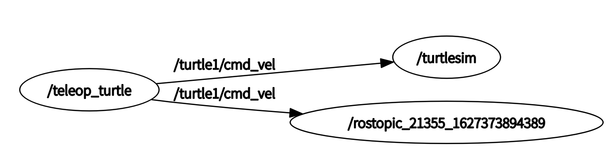
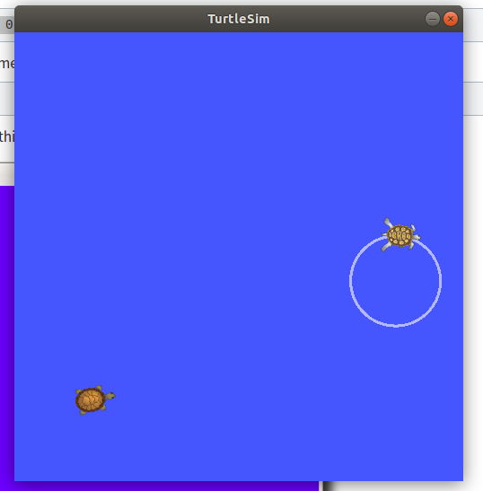

### 1. Install and Configure

```shell
$ mkdir -p ~/catkin_ws/src
$ cd ~/catkin_ws/
$ catkin_make
```

for python3 user in ROS melodic and earlier

```shell
$ catkin_make -DPYTHON_EXECUTABLE=/usr/bin/python3
```

Additionally, if you look in your current directory you should now have a 'build' and 'devel' folder. Inside the 'devel' folder you can see that there are now several setup.*sh files. Sourcing any of these files will overlay this workspace on top of your environment. To make sure your workspace is properly overlayed by the setup script, make sure `ROS_PACKAGE_PATH` environment variable includes the directory you're in.

```shell
$ source devel/setup.bash
$ echo $ROS_PACKAGE_PATH
/home/youruser/catkin_ws/src:/opt/ros/kinetic/share
```

##### ROS with Miniconda + python 3.7

在python3环境下，直接使用tf会报错，使用如下流程来安装rospy以及相关支持。

```shell
# conda env 以及基础的py包
conda create -n ros_env python=3.7
conda activate ros_env
conda install scipy
conda install matplotlib
conda install -c anaconda make
pip install empy
pip install pyyaml


##### 安装ros相关包 non-catkin package
cd ~/miniconda3/envs/ros_demo/
mkdir pycode && cd pycode
 
# 安装rospkg
git clone https://github.com/ros-infrastructure/rospkg.git
cd rospkg/
python setup.py install
 
# 安装sip
cd ..
# 下载地址 https://riverbankcomputing.com/software/sip/download
cd sip-4.19.3
python configure.py 
make
sudo make install


###### catkin package
cd ~/miniconda3/envs/ros_demo/
mkdir -p catkin_ws/src && cd catkin_ws/src
 
# 下载tf与tf2
git clone -b indigo-devel https://github.com/ros/geometry.git
git clone -b indigo-devel https://github.com/ros/geometry2.git
 
 
# 下载/安装orocos
### (option1) 下载tf所需orocos_kinematics_dynamics，直接下载kinetic对应的1.3.1版本
https://github.com/orocos/orocos_kinematics_dynamics/releases/tag/1.3.1
 
### (option2)
sudo apt install ros-kinetic-oro*
 
 
# 下载cv2
git clone -b kinetic https://github.com/ros-perception/vision_opencv.git


########## 注释 geometry2/test_tf2/CmakeLists.txt中的内容

if(NOT CATKIN_ENABLE_TESTING)
  return()
endif()

######### catkin_make

cd ~/miniconda3/envs/ros_demo/catkin_ws
catkin_make_isolated --cmake-args \
-DCMAKE_BUILD_TYPE=Release \
-DPYTHON_EXECUTABLE=~/miniconda3/envs/ros_demo/bin/python \
-DPYTHON_INCLUDE_DIR=~/miniconda3/envs/ros_demo/include/python3.7m \
-DPYTHON_LIBRARY=~/miniconda3/envs/ros_demo/lib/libpython3.7m.so
source devel_isolated/setup.bash


###### 在.bashrc中添加以下内容
source ~/App/miniconda3/envs/ros/catkin_ws/devel_isolated/setup.bash		# 或者 setup.zsh


######### 测试

Python 3.7.8 | packaged by conda-forge | (default, Jul 23 2020, 03:54:19) 
[GCC 7.5.0] on linux
Type "help", "copyright", "credits" or "license" for more information.
>>> import rospy
>>> rospy
<module 'rospy' from '/opt/ros/kinetic/lib/python2.7/dist-packages/rospy/__init__.py'>
>>> import tf
>>> tf
<module 'tf' from '/home/f/miniconda3/envs/ros_demo/catkin_ws/devel_isolated/tf/lib/python3/dist-packages/tf/__init__.py'>
>>>


###### 如何在Ros环境下使用Python3的包
# 将#！env/usr/bin python 改为#！env/usr/bin python3


```


### 2. ROS Filesystem

install ros-tutorials package, Replace '<distro>' (including the '<>') with the name of your ROS distribution (e.g. indigo, kinetic, lunar etc.)

```shell
$ sudo apt-get install ros-<distro>-ros-tutorials
```

##### rospack find

```shell
$ rospack find [package_name]

$ rospack find roscpp
YOUR_INSTALL_PATH/share/roscpp
```

##### roscd

```shell
$ roscd <package-or-stack>[/subdir]

$ roscd roscpp
$ pwd
YOUR_INSTALL_PATH/share/roscpp

$ roscd roscpp/cmake
$ pwd
YOUR_INSTALL_PATH/share/roscpp/cmake

$ roscd log

```

Note that [roscd](http://wiki.ros.org/roscd), like other ROS tools, will *only* find ROS packages that are within the directories listed in your [ROS_PACKAGE_PATH](http://wiki.ros.org/ROS/EnvironmentVariables#ROS_PACKAGE_PATH). To see what is in your [ROS_PACKAGE_PATH](http://wiki.ros.org/ROS/EnvironmentVariables#ROS_PACKAGE_PATH), type:

```shell
$ echo $ROS_PACKAGE_PATH
/opt/ros/kinetic/base/install/share

```

##### rosls

```shell
$ rosls <package-or-stack>[/subdir]
$ rosls roscpp_tutorials
cmake launch package.xml  srv

```


### 3. Create a ROS Package

ROS package folder structure

```shell
my_package/
 	CMakeLists.txt
 	package.xml
```

```shell
workspace_folder/        -- WORKSPACE
  src/                   -- SOURCE SPACE
    CMakeLists.txt       -- 'Toplevel' CMake file, provided by catkin
    package_1/
      CMakeLists.txt     -- CMakeLists.txt file for package_1
      package.xml        -- Package manifest for package_1
    ...
    package_n/
      CMakeLists.txt     -- CMakeLists.txt file for package_n
      package.xml        -- Package manifest for package_n
```

workflow for creating ros package

```shell
# You should have created this in the Creating a Workspace Tutorial
$ cd ~/catkin_ws/src

# This is an example, do not try to run this
# catkin_create_pkg <package_name> [depend1] [depend2] [depend3]
$ catkin_create_pkg beginner_tutorials std_msgs rospy roscpp

# catkin_make, build the whole package
$ cd ~/catkin_ws
$ catkin_make

# source package
$ source catkin_ws/devel/setup.zsh		# or setup.bash

# check dependencies
rospack depends1 beginner_tutorials			# 1. order dependencies
rospack depends beginner_tutorials			 #  all dependencies

```


### 4. Build a ROS Package

```shell
$ cd ~/catkin_ws/
$ ls src
	beginner_tutorials/  CMakeLists.txt@  

$ catkin_make
```

 

### 5. ROS Node

quick overview of graph concepts

-   [Nodes](http://wiki.ros.org/Nodes): A node is an executable that uses ROS to communicate with other nodes.
-   [Messages](http://wiki.ros.org/Messages): ROS data type used when subscribing or publishing to a topic.
-   [Topics](http://wiki.ros.org/Topics): Nodes can *publish* messages to a topic as well as *subscribe* to a topic to receive messages.
-   [Master](http://wiki.ros.org/Master): Name service for ROS (i.e. helps nodes find each other)
-   [rosout](http://wiki.ros.org/rosout): ROS equivalent of stdout/stderr
-   [roscore](http://wiki.ros.org/roscore): Master + rosout + parameter server (parameter server will be introduced later)

```shell
# start roscore
$ roscore

# list all ros nodes
$ rosnode list
	/rosout

# check rosnode info
$ rosnode info /rosout
	
# run rosnode
$ rosrun [package_name] [node_name]
$ rosrun turtlesim turtlesim_node
$ rosnode list
	/rosout
	/turtlesim
	
# rename rosnode 
$ rosrun turtlesim turtlesim_node __name:=my_turtle
$ rosnode list
	/my_turtle
	/rosout

# ping rosnode
$ rosnode ping my_turtle
	rosnode: node is [/my_turtle]
	pinging /my_turtle with a timeout of 3.0s
	xmlrpc reply from http://aqy:42235/     time=1.152992ms
	xmlrpc reply from http://aqy:42235/     time=1.120090ms
	...

	
```


### 6. ROS Topics

##### ROS topic usage

```shell
$ rostopic -h
Commands:
	rostopic bw	display bandwidth used by topic
	rostopic delay	display delay of topic from timestamp in header
	rostopic echo	print messages to screen
	rostopic find	find topics by type
	rostopic hz	display publishing rate of topic    
	rostopic info	print information about active topic
	rostopic list	list active topics
	rostopic pub	publish data to topic
	rostopic type	print topic or field type
```

Example:

```shell
$ roscore
$ rosrun turtlesim turtlesim_node
$ rosrun turtlesim turtle_teleop_key		  # keyboard remote node				
```

##### rostopic echo

```shell
$ rostopic echo /turtle1/cmd_vel
linear: 
  x: 2.0
  y: 0.0
  z: 0.0
angular: 
  x: 0.0
  y: 0.0
  z: 0.0
---

# rqt_graph, show topic, publisher, subcriber
$ rosrun rqt_graph rqt_graph		
```




##### rostopic list

```shell
$ rostopic list -h
    Usage: rostopic list [/topic]
    Options:
          -h, --help            show this help message and exit
          -b BAGFILE, --bag=BAGFILE 		  list topics in .bag file
          -v, --verbose         								list full details about each topic
          -p                    										  list only publishers
          -s                   											   list only subscribers
```

```shell
$ rostopic list -v
    Published topics:
     * /turtle1/color_sensor [turtlesim/Color] 1 publisher
     * /turtle1/cmd_vel [geometry_msgs/Twist] 1 publisher
     * /rosout [rosgraph_msgs/Log] 3 publishers
     * /rosout_agg [rosgraph_msgs/Log] 1 publisher
     * /turtle1/pose [turtlesim/Pose] 1 publisher

    Subscribed topics:
     * /turtle1/cmd_vel [geometry_msgs/Twist] 1 subscriber
     * /rosout [rosgraph_msgs/Log] 1 subscriber
     * /statistics [rosgraph_msgs/TopicStatistics] 1 subscriber

```

##### rostopic type

```shell
$ rostopic type /turtle1/cmd_vel
    geometry_msgs/Twist

$ rostopic type /turtle1/cmd_vel | rosmsg show
    geometry_msgs/Vector3 linear
      float64 x
      float64 y
      float64 z
    geometry_msgs/Vector3 angular
      float64 x
      float64 y
      float64 z

```

##### rostopic info

```shell
$ rostopic info /turtle1/cmd_vel
    Type: geometry_msgs/Twist

    Publishers: 
     * /teleop_turtle (http://shan-ubuntu:36047/)

    Subscribers: 
     * /turtlesim (http://shan-ubuntu:33797/)
```

##### rostopic pub

```shell
# rostopic pub [topic] [msg_type] [args]
$ rostopic pub -1 /turtle1/cmd_vel geometry_msgs/Twist -- '[2.0, 0.0, 0.0]' '[0.0, 0.0, 1.8]'

# a steady stream of commands at 1 Hz to keep moving
$ rostopic pub /turtle1/cmd_vel geometry_msgs/Twist -r 1 -- '[2.0, 0.0, 0.0]' '[0.0, 0.0, -1.8]'

$ rosrun rqt_graph rqt_graph		# show node graph
$ rostopic echo /turtle1/pose		 # echo topic message
```


##### rostopic hz

```shell
$ rostopic hz /turtle1/pose

# rate of 60 Hz
        average rate: 62.500
            min: 0.015s max: 0.017s std dev: 0.00044s window: 811
        average rate: 62.499
            min: 0.015s max: 0.017s std dev: 0.00044s window: 874
        average rate: 62.501
            min: 0.015s max: 0.017s std dev: 0.00044s window: 936
        average rate: 62.498
            min: 0.015s max: 0.017s std dev: 0.00044s window: 999
        average rate: 62.502
            min: 0.015s max: 0.017s std dev: 0.00044s window: 1062

```

##### rqt_plot

```shell
$ rosrun rqt_plot rqt_plot
```


### 7. ROS Service Params

#### ROS Service usage

```shell
$ rosservice list          	 # print information about active services
$ rosservice call         	# call the service with the provided args
$ rosservice type         # print service type
$ rosservice find          # find services by service type
$ rosservice uri          	 # print service ROSRPC uri
```

##### rosservice list

```shell
$ rosservice list
		/clear
        /kill
        /reset
        /rosout/get_loggers
        /rosout/set_logger_level
        /spawn
        /teleop_turtle/get_loggers
        /teleop_turtle/set_logger_level
        /turtle1/set_pen
        /turtle1/teleport_absolute
        /turtle1/teleport_relative
        /turtlesim/get_loggers
        /turtlesim/set_logger_level
```

##### roservice type

```shell
# rosservice type [service]
$ rosservice type /clear
		std_srvs/Empty

```

##### rosservice call

```shell
# rosservice call [service] [args]
$ rosservice call /clear			# clear the background of the turtlesim_node

```

##### rosservice type

```shell
$ rosservice type /spawn | rossrv show
        float32 x
        float32 y
        float32 theta
        string name
        ---
        string name
```

##### rosservice call

```shell
$ rosservice call /spawn 2 2 0.2 ""		# spawn a new turtle 
```



#### rosparam 

```shell
$ rosparam set            # set parameter
$ rosparam get            # get parameter
$ rosparam load         # load parameters from file
$ rosparam dump     # dump parameters to file
$ rosparam delete     # delete parameter
$ rosparam list          	# list parameter names
```

##### rosparam list

```shell
$ rosparam list
		/rosdistro
        /roslaunch/uris/host_nxt__43407
        /rosversion
        /run_id
        /turtlesim/background_b
        /turtlesim/background_g
        /turtlesim/background_r
```

##### rosparam set

```shell
# rosparam set [param_name]
$ rosparam set /turtlesim/background_r 150		# change background color

# call the clear service for the parameter change to take effect
$ rosservice call /clear
```

##### rosparam get

```shell
$ rosparam get /turtlesim/background_g 
		86


# show all param from param server
$ rosparam get /
        rosdistro: 'melodic

          '
        roslaunch:
          uris: {host_shan_ubuntu__45705: 'http://shan-ubuntu:45705/'}
        rosversion: '1.14.11

          '
        run_id: 610a30ea-eeb1-11eb-ba72-70c94e48a4d0
        turtlesim: {background_b: 255, background_g: 86, background_r: 150}

```

##### rosparam dump

```shell
# rosparam dump [file_name] [namespace]
# write all the parameters to the file params.yaml
$ rosparam dump params.yaml

```

##### rosparam load

```shell
# rosparam load [file_name] [namespace]
$ rosparam load params.yaml copy_turtle
$ rosparam get /copy_turtle/turtlesim/background_b
		255
```


### 8. rqt_console and roslaunch

#### rqt_consle

```shell
$ rosrun rqt_console rqt_console
$ rosrun rqt_logger_level rqt_logger_level

#  let's run our turtle into the wall and see what is displayed in our rqt_console
$ rostopic pub /turtle1/cmd_vel geometry_msgs/Twist -r 1 -- '{linear: {x: 2.0, y: 0.0, z: 0.0}, angular: {x: 0.0,y: 0.0,z: 0.0}}'

```

logger levels

```
Fatal
Error
Warn
Info
Debug
```


#### roslaunch

`roslaunch` starts nodes as defined in a launch file

```shell
$ roslaunch [package] [filename.launch]

# example
$ cd ~/catkin_ws
$ source devel/setup.bash
$ roscd beginner_tutorials
$ mkdir launch
$ cd launch
$ vi turtlemimic.launch

# 使用roslaunch 启动turtlesim，mimic，将一个乌龟的位置传递给另一个乌龟
$ roslaunch beginner_tutorials turtlemimic.launch
$ rostopic pub /turtlesim1/turtle1/cmd_vel geometry_msgs/Twist -r 1 -- '[2.0, 0.0, 0.0]' '[0.0, 0.0, -1.8]'

```

```xml
<launch>

  <group ns="turtlesim1">
    <node pkg="turtlesim" name="sim" type="turtlesim_node"/>
  </group>

  <group ns="turtlesim2">
    <node pkg="turtlesim" name="sim" type="turtlesim_node"/>
  </group>

  <node pkg="turtlesim" name="mimic" type="mimic">
    <remap from="input" to="turtlesim1/turtle1"/>
    <remap from="output" to="turtlesim2/turtle1"/>
  </node>

</launch>
```


### 9. rosed

`rosed` is part of the [rosbash](http://wiki.ros.org/rosbash) suite. It allows you to directly edit a file within a package by using the package name rather than having to type the entire path to the package.

```shell
# $ rosed [package_name] [filename]
$ rosed roscpp Logger.msg
```


### 10. MSG and SRV

msg files are stored in the `msg` directory of a package, and srv files are stored in the `srv` directory.

-   [msg](http://wiki.ros.org/msg): msg files are simple text files that describe the fields of a ROS message. They are used to generate source code for messages in different languages.

    -   ```
        -   int8, int16, int32, int64 (plus uint*)
        -   float32, float64
        -   string
        -   time, duration
        -   other msg files
        -   variable-length array[] and fixed-length array[C]
        -   Header, the header contains a timestamp and coordinate frame information that are commonly used in ROS
        ```

    -   msg/Num.msg

        ```
          Header header
          string child_frame_id
          geometry_msgs/PoseWithCovariance pose
          geometry_msgs/TwistWithCovariance twist
        ```

    -   package.xml

        ```xml
          <build_depend>message_generation</build_depend>
          <exec_depend>message_runtime</exec_depend>
        ```

    -    CMakeLists.txt

        ```cmake
        find_package(catkin REQUIRED COMPONENTS
           roscpp
           rospy
           std_msgs
           message_generation
        )
        
        catkin_package(
          ...
          CATKIN_DEPENDS message_runtime ...
          ...)
          
          add_message_files(
          FILES
          Num.msg
        )
        
        generate_messages(
          DEPENDENCIES
          std_msgs
        )
        ```

    -   rosmsg

        ```shell
        rosmsg is a command-line tool for displaying information about ROS Message types.
        
        Commands:
        	rosmsg show	Show message description
        	rosmsg info	Alias for rosmsg show
        	rosmsg list	List all messages
        	rosmsg md5	Display message md5sum
        	rosmsg package	List messages in a package
        	rosmsg packages	List packages that contain messages
        
        
        # $ rosmsg show [message type]
        $ rosmsg show beginner_tutorials/Num
        		int64 num
                string first_name
                string last_name
                uint8 age
                uint32 score
        
        # if you forget the package name
        $ rosmsg show Num		
                [beginner_tutorials/Num]:
                int64 num
                string first_name
                string last_name
                uint8 age
                uint32 score
        ```
        
        
        


-   [srv](http://wiki.ros.org/srv): an srv file describes a service. It is composed of two parts: a request and a response. The two parts are separated by a '---' line. Here is an example of a srv file:

    ```
    # request
    int64 A
    int64 B
    ---
    # response
    int64 Sum
    ```

    -   create a srv

        ```shell
        $ roscd beginner_tutorials
        $ mkdir srv
        
        # Instead of creating a new srv definition by hand, 
        # we will copy an existing one from another package
        # $ roscp [package_name] [file_to_copy_path] [copy_path]
        $ roscp rospy_tutorials AddTwoInts.srv srv/AddTwoInts.srv
        
        ```

    -   package.xml

        ```xml
          <build_depend>message_generation</build_depend>
          <exec_depend>message_runtime</exec_depend>
        ```

    -    CMakeLists.txt

         ```CMAKE
         # Do not just add this line to your CMakeLists.txt, modify the existing line
         find_package(catkin REQUIRED COMPONENTS
           roscpp
           rospy
           std_msgs
           message_generation
         )
         
         add_service_files(
           FILES
           AddTwoInts.srv
         )
         ```

    -   rossrv

        ```shell
        rossrv is a command-line tool for displaying information about ROS Service types.
        
        Commands:
        	rossrv show	Show service description
        	rossrv info	Alias for rossrv show
        	rossrv list	List all services
        	rossrv md5	Display service md5sum
        	rossrv package	List services in a package
        	rossrv packages	List packages that contain services
        
        
        
        $ rossrv show <service type>
        $ rossrv show beginner_tutorials/AddTwoInts
                int64 a
                int64 b
                ---
                int64 sum
                
        $ rossrv show AddTwoInts
                [beginner_tutorials/AddTwoInts]:
                int64 a
                int64 b
                ---
                int64 sum
        
                [rospy_tutorials/AddTwoInts]:
                int64 a
                int64 b
                ---
                int64 sum
        ```

        

        

### 11. rosbag

The list of published topics are the only message types that could potentially be recorded in the data log file, as only published messages are recorded. 

##### rosbag record

```shell
# run turtlesim to record its bagfile
$ roscore
$ rosrun turtlesim turtlesim_node

# rosbag record
$ mkdir ~/bagfiles
$ cd ~/bagfiles
$ rosbag record -a

# run some topic to record
$ rosrun turtlesim turtle_teleop_key 
```

#####  rosbag info

```
$ rosbag info <your bagfile>

path:        2021-07-29-13-16-46.bag
version:     2.0
duration:    40.1s
start:       Jul 29 2021 13:16:46.20 (1627535806.20)
end:         Jul 29 2021 13:17:26.34 (1627535846.34)
size:        372.2 KB
messages:    5189
compression: none [1/1 chunks]
types:       geometry_msgs/Twist [9f195f881246fdfa2798d1d3eebca84a]
             rosgraph_msgs/Log   [acffd30cd6b6de30f120938c17c593fb]
             turtlesim/Color     [353891e354491c51aabe32df673fb446]
             turtlesim/Pose      [863b248d5016ca62ea2e895ae5265cf9]
topics:      /rosout                    4 msgs    : rosgraph_msgs/Log   (2 connections)
             /turtle1/cmd_vel         193 msgs    : geometry_msgs/Twist
             /turtle1/color_sensor   2496 msgs    : turtlesim/Color    
             /turtle1/pose           2496 msgs    : turtlesim/Pose

```

##### rosbag play 

```
$ rosbag play <your bagfile>

[ INFO] [1418271315.162885976]: Opening 2014-12-10-20-08-34.bag
Waiting 0.2 seconds after advertising topics... done.
Hit space to toggle paused, or 's' to step.
```

```shell
$ rosbag play -s 20 <bagfile> 		# 从第20s开始
$ rosbag play -r 2 <bagfile>		 # 两倍的重放速度	
```

##### rosbag record -O subset

```shell
# run turtlesim
$ roscore
$ rosrun turtlesim turtlesim_node
$ rosrun turtlesim turtle_teleop_key

# record subset rosbag
rosbag record -O subset /turtle1/cmd_vel /turtle1/pose

# check info
$ rosbag info subset.bag
        path:        subset.bag
        version:     2.0
        duration:    22.4s
        start:       Jul 29 2021 13:41:43.77 (1627537303.77)
        end:         Jul 29 2021 13:42:06.15 (1627537326.15)
        size:        52.2 MB
        messages:    516109
        compression: none [62/62 chunks]
        types:       geometry_msgs/Twist [9f195f881246fdfa2798d1d3eebca84a]
                     turtlesim/Pose      [863b248d5016ca62ea2e895ae5265cf9]
        topics:      /turtle1/cmd_vel   514710 msgs    : geometry_msgs/Twist
                     /turtle1/pose        1399 msgs    : turtlesim/Pose

```

##### read from bagfile

-   rosbag play --topics

```shell
# check rosbag info
$ time rosbag info demo.bag  
# OR (if you know part of the topic names of interest before-hand):
$ time rosbag info mybag.bag | grep -E "(topic1|topic2|topic3)"
```

```shell
$ roscore

$ rostopic echo /obs1/gps/fix | tee topic1.yaml
WARNING: topic [/obs1/gps/fix] does not appear to be published yet

$ rostopic echo /diagnostics_agg | tee topic2.yaml
WARNING: topic [/diagnostics_agg] does not appear to be published yet


# $ time rosbag play --immediate demo.bag --topics /topic1 /topic2 /topic3 /topicN
$ time rosbag play --immediate demo.bag --topics /obs1/gps/fix /diagnostics_agg

```


### 12. ROS action

ROS中有一个名为**actionlib**的功能包，实现了action的通信机制。那什么是action呢？

**action是一种类似于Service的问答通信机制，不同之处在于action带有连续反馈，可以不断反馈任务进度，也可以在任务过程中中止运行。**


Client向Server端发布任务目标以及在必要的时候取消任务，Server会向Client发布当前状态、实时反馈和任务执行的最终结果。

（1）goal：发布任务目标；
（2）cancel：请求取消任务；
（3）status：通知Client当前的状态；
（4）feedback：周期反馈任务运行的监控数据；
（5）result：向Client发送任务的执行结果，只发布一次。
